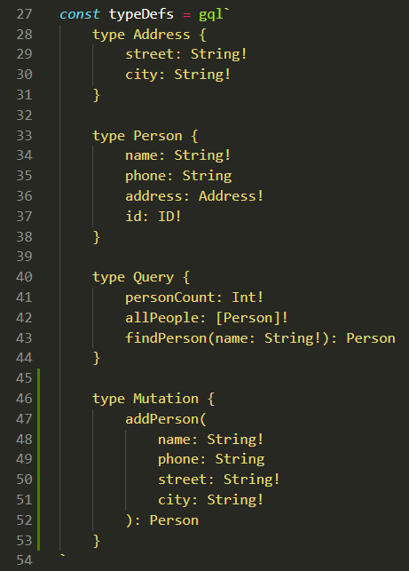
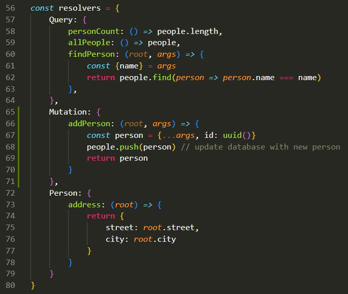
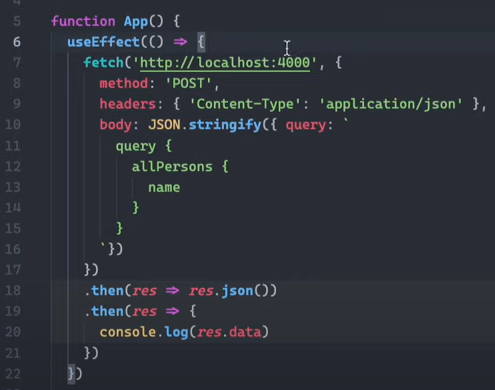
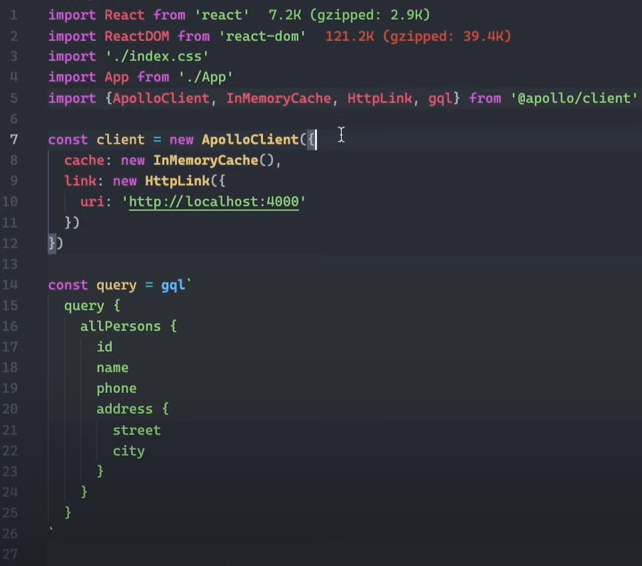
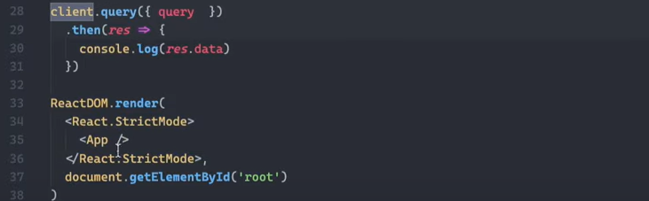
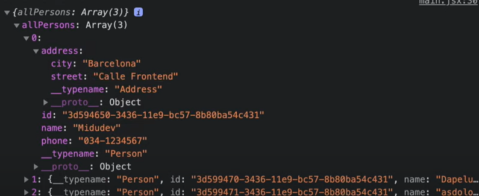

# GraphQL
A query language for your API.


## 🚀 Getting Started
We are installing GraphQL and Apollo Server:
```bash
npm i graphql apollo-server
```

### 📄 Docs
`index.js`: the server.

##### SpaceX open API graphql Apollo: https://studio.apollographql.com/public/SpaceX-pxxbxen/variant/current/explorer 

## 🤔 Explanation
We have to look at the following aspects in `index.js`:
- **Data**
- **Type Definitions**:  Define the tables
- **Resolvers**: Add methods
- **Server**

### Data:


### Type Definitions:


### Resolvers:


### Server:


---

### ❗Careful
It is important to distinguish the structure of the information that comes from the api or database (in this case the `Data` with the const `people`), from how we are showing this information with GraphQL. For instance in this case:

**1. Api:**
```js
{
    name: "Midu",
    phone: "034-1234567",
    street: "Calle Frontend",
    city: "Barcelona",
    id: "3d594650-3436-11e9-bc57-8b80ba54c431"
}
```

**2. GraphQL** (How we are showing it):
```js
{
    name: "Midu",
    phone: "034-1234567",
    address: {
        street: "Calle Frontend",
        city: "Barcelona",
    },
    id: "3d594650-3436-11e9-bc57-8b80ba54c431"
}
```
This is an example of the second case: **2. GraphQL**, using apollo:


## 🧌 Mutations
A Mutation is a GraphQL Operation that allows you to insert new data or modify the existing data on the server-side. You can think of GraphQL Mutations as the equivalent of POST , PUT , PATCH and DELETE requests in REST.

This is how we add one:
### Type definitions

### Resolvers


## ⚛️ Add GraphQl in your React App
There are several options:
- fetch
- clients:
  - Apollo Client
  - Relay
  - urql

In the case of Apollo Client for instance, you don't have to use Apollo Server. It's up to you.

### Fetch
This is the basic approach using fetch:



### Apollo Client
#### Code


#### Response


[Apollo Client documentation](https://www.apollographql.com/docs/react)

##### More information about how to add GraphQl in your React App-> https://www.youtube.com/watch?v=sVFocedf-iU&ab_channel=midudev
