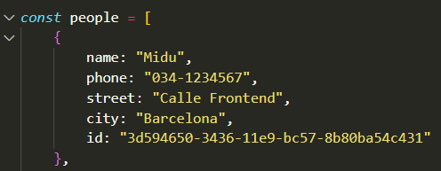
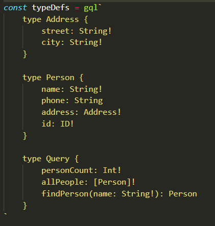
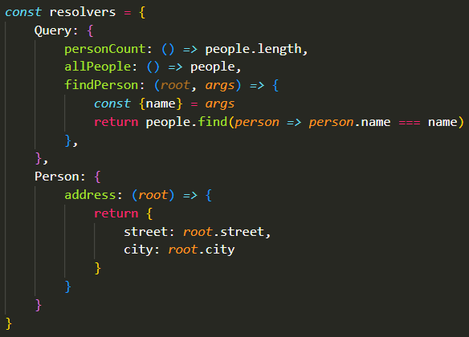
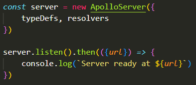
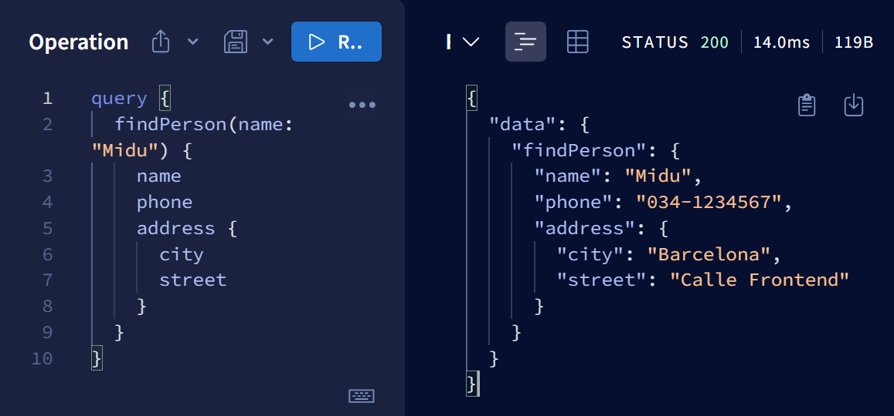

# GraphQL
A query language for your API.


## 🚀 Getting Started
We are installing GraphQL and Apollo Server:
```bash
npm i graphql apollo-server
```

### 📄 Docs
`index.js`: the server.

##### SpaceX open API graphql Apollo: https://studio.apollographql.com/public/SpaceX-pxxbxen/variant/current/explorer 

## 🤔 Explanation
We have to look at the following aspects in `index.js`:
- Data
- Type Definitions: 
  - Define the tables
- Resolvers
  - Add methods
- Server

### Data:


### Type Definitions:


### Resolvers:


### Server:


---

### ❗Careful
It is important to distinguish the structure of the information that comes from the api or database (in this case the `Data` with the const `people`), from how we are showing this information with GraphQL. For instance in this case:

**1. Api:**
```js
{
    name: "Midu",
    phone: "034-1234567",
    street: "Calle Frontend",
    city: "Barcelona",
    id: "3d594650-3436-11e9-bc57-8b80ba54c431"
}
```

**2. GraphQL** (How we are showing it):
```js
{
    name: "Midu",
    phone: "034-1234567",
    address: {
        street: "Calle Frontend",
        city: "Barcelona",
    },
    id: "3d594650-3436-11e9-bc57-8b80ba54c431"
}
```
This is an example of the second case: **2. GraphQL**, using apollo:
