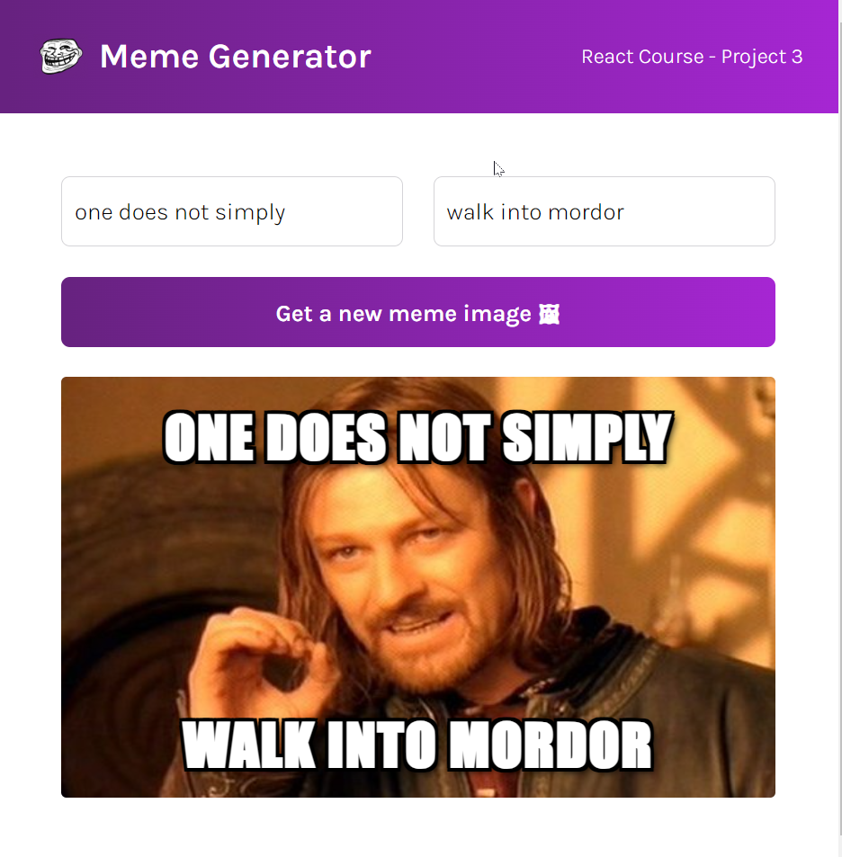
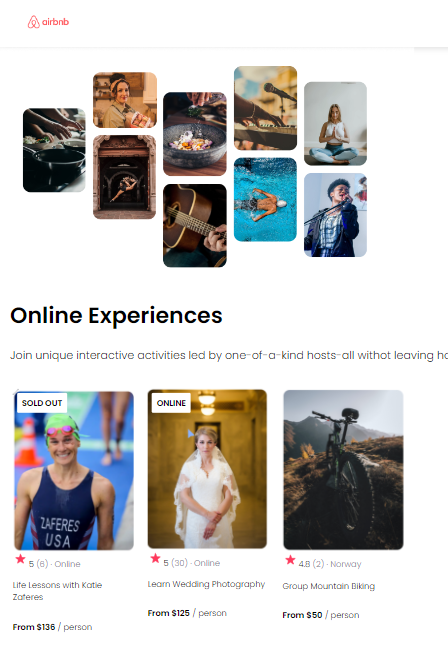

These are my React projects.

## 🚀 Getting Started

To launch one React project you will need to follow the next steps:
1. Clone the code:
```
git clone git@github.com:CosmeValera/react-learning.git
```
2. Install the dependencies
```
npm i
```
3. Start the project
```
npm start
```

Open [http://localhost:3000](http://localhost:3000) to view it in your browser.

## 📒 Projects (From Most Recent to Oldest)

### Meme Generator:

**Learned**: 
- UseState
- UseEffect
- Forms
- Events (onClick, onMouseOver...)
- Fetch and call to API

---

### AirBnb Experience:

**Learned**: 
- Props
- Array.map
- Create project from scratch using Vite
```
npm create vite@latest
```

---

### Facts about React:

**Learned**: 
- Create React components
- How React DOM works
- Create project from scratch 
```
npx create-react-app my-react-app
```

---

###### I'm following this tutorial-> https://www.youtube.com/watch?v=bMknfKXIFA8&t=6703s