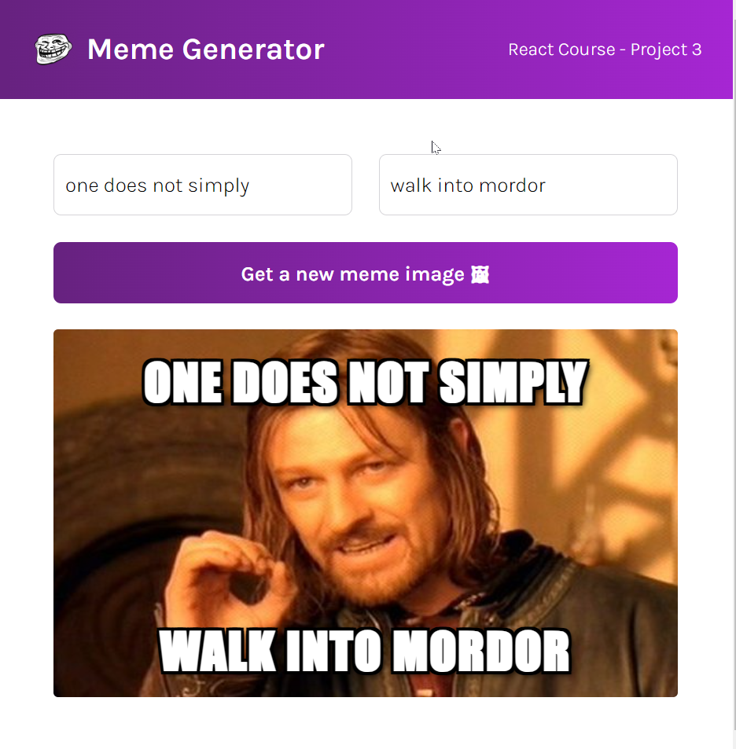
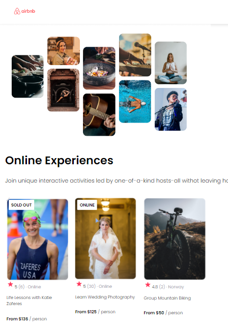
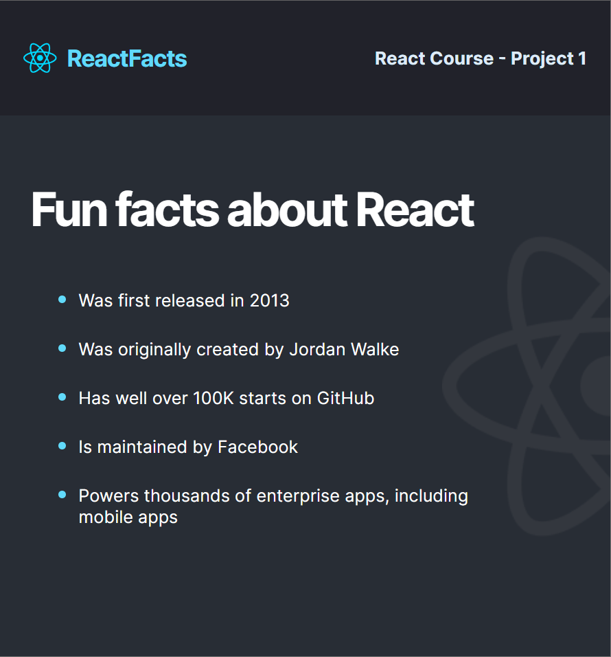
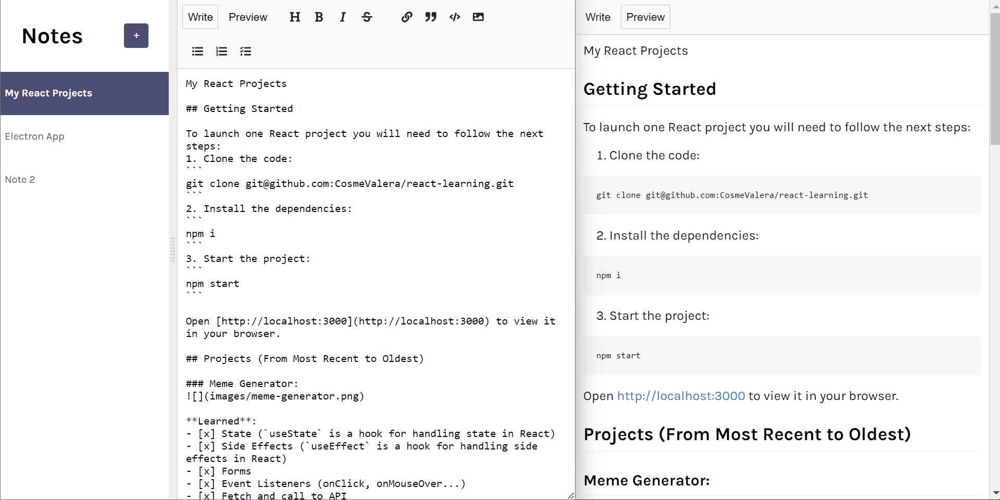
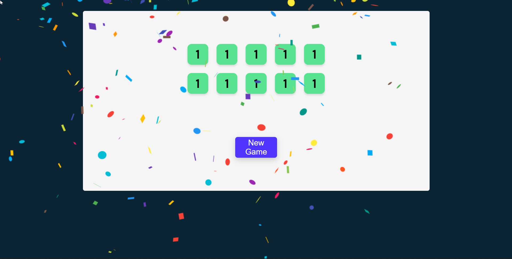
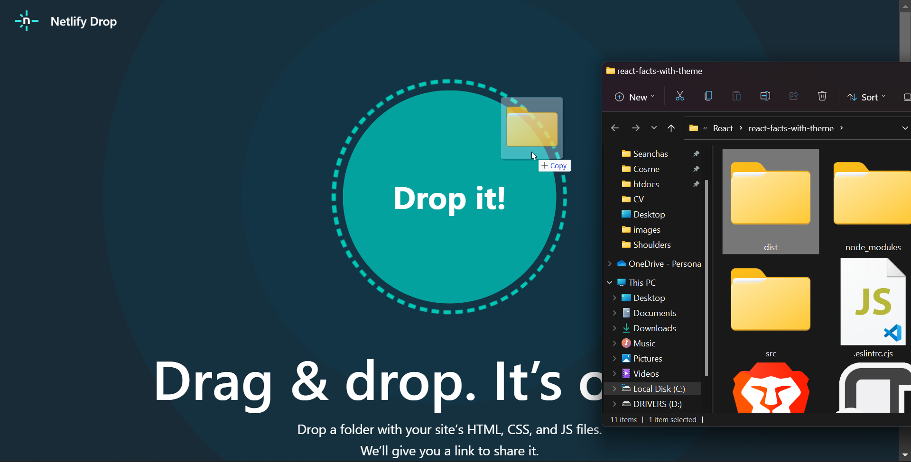

## 🚀 Getting Started

To launch one React project you will need to follow the next steps:
1. Clone the code:
```
git clone git@github.com:CosmeValera/react-learning.git
```
2. Open your terminal and navigate to the root directory:
```
cd ReactProjects
```

3. Navigate to a project directory (these 3 are `Vite`):
```
cd learning-react/tenzies/
```
or
```
cd learning-react/meme-generator/
```
or
```
cd learning-react/notes-app/
```
4. Install the dependencies:
```
npm i
```

5. Start `Vite` project:
```
npm run dev
```

Open [http://localhost:5173](http://localhost:5173) to view it in your browser.

Or

5. Start `create-react-app` project:
```
npm start
```

Open [http://localhost:3000](http://localhost:3000) to view it in your browser.

## 📒 Projects (From Most Recent to Oldest)

### Meme Generator:


**Learned**: 
- [x] State (`useState` is a hook for handling state in React)
- [x] Side Effects (`useEffect` is a hook for handling side effects in React)
- [x] Forms
- [x] Event Listeners (onClick, onMouseOver...)
- [x] Fetch and call to API
- [x] Conditional rendering

---

### AirBnb Experience:


**Learned**: 
- [x] Props
- [x] Array.map
- [x] Create project from scratch using `Vite`
```
npm create vite@latest
```

---

### Facts about React:


**Learned**: 
- [x] Create React components
- [x] How React DOM works
- [x] Create project from scratch 
```
npx create-react-app my-react-app
```

---
## 📒➕ Other Projects
### Notes App

**Learned**: 
- [x] Debouncing effect
- [x] Firebase
- [x] Local Storage
### Tenzies

**Learned**: 
- [x] React Confetti
```
npm install react-confetti
```

---
## ➕ Other things I learned
### Add Standard Lintern:
1. Type in the terminal:
```
npm install standard -D
```
2. Add in the package.json:
```
"eslintConfig": {
"extends": "./node_modules/standard/eslintrc.json"
}
```
3. To run the lintern, type in the terminal:
```
npm run lint
```

### Deploy in Netlify
To deploy our project we are going to build it first and then drop the /dist files in `Netlify`. Here's how:
1. Build the project
```
npm run build
```
2. Open the following URL:

https://app.netlify.com/drop/

3. Drop the dist folder inside the web:



Enjoy your deployed app!! 😀

---

###### Tutorial-> https://www.youtube.com/watch?v=bMknfKXIFA8
