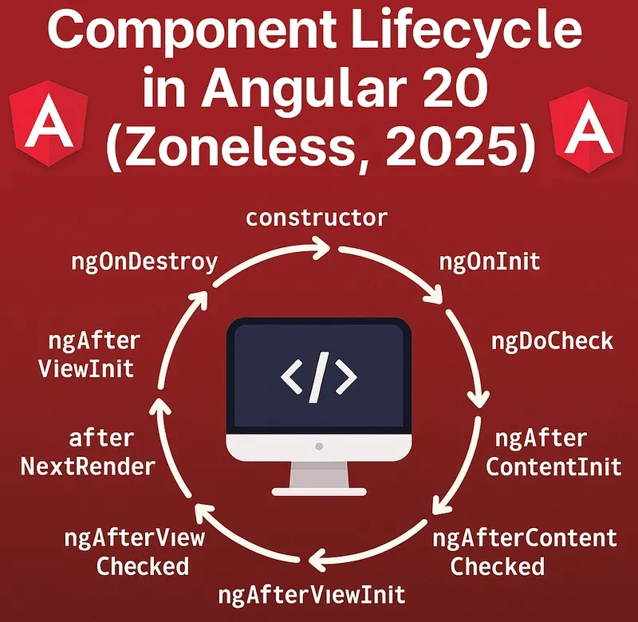

<!-- Tutorial: https://www.youtube.com/watch?v=f7unUpshmpA -->

# 🅰️ Angular

Angular is a JS framework for building user interfaces. Angular enforces a very structured code organization (e.g., separate files for component logic, template, and styles), which helps keep large projects maintainable. It’s highly opinionated and includes many built-in features (routing, guards, dependency injection, etc.). It's one of the most popular JS frontend frameworks alongside React and Vue.

## 👍 Getting Started
```bash
# Create a new Angular project
ng new angular-17-app

# Run the development server
ng serve
```

> Run `npm install -g @angular/cli` in case you don't have angular. Use `ng version` to check if you do.

## Important files

```py
.
├── src/
│   ├── index.html            # Base HTML: mounts <app-root>
│   ├── main.ts               # Entry point: bootstraps the app
│   │── styles.css            # Global styles
│   └── app/
│       ├── app.ts            # Root component (logic)
│       ├── app.html          # Root component template
│       ├── app.css           # Root component styles
│       ├── app.config.ts     # App-wide providers (router, HTTP client, etc.)
│       └── app.routes.ts     # Route definitions
└── angular.json              # CLI config (build, serve, test options)
```

## How to create components
Command to generate a component with Angular.
```py
ng generate component user
```
```py
# OUTPUT
CREATE src/app/user/user.ts (189 bytes)
CREATE src/app/user/user.html (20 bytes)
CREATE src/app/user/user.css (0 bytes)
CREATE src/app/user/user.spec.ts (540 bytes)
```

To use the component, 1. import it and 2. add it in the HTML part:
```py
import { User } from "./user/user";

@Component({
  selector: 'app-root',
  imports: [RouterOutlet, User],
  template: `
    <h1>My app header</h1>
    <app-user/>
  `,
  styles: `h1 {color: green}`
})
export class App { ... }
```

### Other `ng generate` commands:
```bash
# Components
ng generate component user
ng g c user                         # shorthand
ng g c user --inline-template       # no separate .html file
ng g c user --inline-style          # no separate .css file
ng g c user --skip-tests            # no .spec.ts file
ng g c user --dry-run               # preview without creating files
ng g c user --flat                  # no subfolder created
ng g c user --inline-template --inline-style --skip-tests # you can combine flags. Here: inline and no tests

# Other schematics
ng g service user                   # user.service.ts
ng g pipe user                      # user.pipe.ts
ng g directive user                 # user.directive.ts
ng g guard user                     # route guard
ng g interceptor user               # HTTP interceptor

# Docu: https://www.tutorialspoint.com/angular_cli/angular_cli_ng_generate.htm
```

## Component 
The TS, SCSS and HTML can be set in different files or inline:

```ts
// Different files
@Component({
  selector: 'app-root',
  imports: [RouterOutlet],
  templateUrl: './app.html',
  styleUrl: './app.css',
})
export class App { ... }

// Inline
@Component({
  selector: 'app-root',
  imports: [RouterOutlet],
  template: `<h1>Hola Mundo</h1>`,
  styles: `h1 {color: green}`
})
export class App { ... }
```

In React, Vue, Svelte, etc, it's being lately more favored having everything in the same file, and have a separation of concerns more focused on the different components instead of in different files. However, Angular has always being typically with different files, and it's at each one preference how you want to do it. General rule: for simple components you can do inline, while for bigger components it's usuarlly more recommended to split into different files.

## Properties and Signals
> Signals are now the recommended way to handle state in Angular!

**TL:DR;** Properties are simpler but trigger broader change detection. Signals are more explicit and granular, making them better for performance and the direction Angular is heading.

Properties are plain TypeScript class fields. Angular detects changes through zone.js, which patches async operations and triggers change detection for the whole component tree, it won't rerender everything, but it's less efficient because zone.js has to walk the tree to find what changed.

Signals (introduced in Angular 16) are reactive primitives. Angular knows exactly which signal changed and updates only the parts of the template that depend on it, no zone.js needed. You call them like a function (`appName()`) to read the value, and use `.set()` / `.update()` to change it:

```ts
@Component({
  selector: 'app-root',
  imports: [RouterOutlet],
  template: `
    <h1>Hola {{city}}</h1>
    <h2>Esto es {{appName()}}</h2>
  `,
  styles: `h1 {color: green}`
})
export class App {
  city = "Murcia";
  appName = signal('angular-17-app');
  // Both can have protected and readonly. Like this: `protected readonly appName = signal('angular-17-app');`
}
```

**Extra: Difference between Signals and useState() (from React):**

Both hold state and update the UI when changed, but the update model is different:

- `useState` → re-renders the **whole component** top to bottom on every change
- Signals → only the **exact DOM nodes** that read the signal update (subscription-based)
```ts
// React: whole component re-renders on change
const [count, setCount] = useState(0);
setCount(1);

// Angular: only {{count()}} in the template updates
count = signal(0);
count.set(1);
count.update(v => v + 1); // based on previous value
```

This is why signals are generally preferred for performance, no unnecessary re-renders, no need for `useMemo`/`useCallback` workarounds. <i>React is solving this differently via the **React Compiler** (auto-memoization), rather than adopting signals.</i>

## Directives (if/else, for, switch)
**If** (@If, @else if, @else):
```js
import { Component, signal } from '@angular/core';

@Component({
  selector: 'app-user',
  imports: [],
  template: `
    @if (isLoggedIn()) {
      <p>Bienvenido, {{ username }}</p>
    } @else {
      <p>¡Iniciá sesión!</p>
    }
  `,
  styleUrl: './user.css',
})
export class User {
  username = 'midudev'
  isLoggedIn = signal(true)
}
```
> I'm using signals and properties for variables indiscriminately

**For** (@for):
```js
@Component({
  selector: 'app-user',
  imports: [],
  template: `
    <ul>
      @for (game of games; track game.id) {
        <li>{{ game.name }}</li>
      }
    </ul>
  `,
  styleUrl: './user.css',
})
export class User {
  games = [
    {
      id: 1,
      name: 'Uncharted 4'
    },
    {
      id: 2,
      name: 'Horizon 4'
    },
    {
      id: 3,
      name: 'Bloodborne'
    }
  ]
}   
```

```html
<!-- Result -->
<app-games _ngcontent-ng-c3605705329="">
  <ul>
    <li>Uncharted 4</li>
    <li>Horizon 4</li>
    <li>Bloodborne</li>
  </ul>
</app-games>
```

**Switch** (@switch, @case):
```js
import { Component, signal } from '@angular/core';

@Component({
  selector: 'app-status',
  imports: [],
  template: `
    @switch (status()) {
      @case ('loading') {
        <p>Cargando...</p>
      }
      @case ('success') {
        <p>¡Datos cargados correctamente!</p>
      }
      @case ('error') {
        <p>Ocurrió un error.</p>
      }
      @default {
        <p>Estado desconocido.</p>
      }
    }
  `,
  styleUrl: './status.css',
})
export class Status {
  status = signal('success')
}
```
```html
<!-- Result -->
<app-status _ngcontent-ng-c3605705329="">
  <p>¡Datos cargados correctamente!</p>
</app-status>
```

## Change state in Angular
To change state in Angular you modify properties or signals directly in the component class. In the template, you bind events with `()` to call methods or update signals inline:
```html
<section>
  @if (isLoggedIn()) {
    <p>Bienvenido, {{ username }}</p>
    
  } @else {
    <button (click)="isLoggedIn.set(true)">¡Iniciá sesión!</button>
  }
  <app-games />
</section>
```
```ts
@Component({ ... })
export class User {
  username = 'cosmecín'
  isLoggedIn = signal(false)

  greet() {
    alert('Hola!!!')
  }
}
```

- `(click)="isLoggedIn.set(true)"`: updates the signal inline, no method needed
- `(dblclick)="greet()"`: calls a class method for more complex logic when double click
- `@if (isLoggedIn())`: reads the signal; Angular updates only this block when it changes

## Pass state in Angular, @Input and @Output
### Input

A parent passes data **down** to a child via `@Input()`.
```ts
// parent file
import { Component } from '@angular/core';
import { Games } from "../games/games";

@Component({
  selector: 'app-user',
  imports: [Games],
  template: `
    <app-games [username]="username" />
  `,
  styles: ``,
})
export class User {
  username = 'cosmecín'
}
```
```ts
// child file
import { Component, Input } from '@angular/core';

@Component({
  selector: 'app-games',
  imports: [],
  template: `
    <h3>Los juegos favoritos de {{ username }}</h3>
  `,
  styles: ``,
})
export class Games {
  @Input() username = ''
}
```

- `[username]="username"`: binds the parent's `username` property to the child's `@Input()`

### Output

A child sends events **up** to the parent via `@Output()` and `EventEmitter`.
```ts
// child file
import { Component, Input, Output, EventEmitter } from '@angular/core';

@Component({
  selector: 'app-games',
  imports: [],
  template: `
    <h3>Los juegos favoritos de {{ username }}</h3>
    <ul>
      @for (game of games; track game.id) {
        <li (click)="pick(game.name)">{{ game.name }}</li>
      }
    </ul>
  `,
  styles: ``,
})
export class Games {
  @Input() username = ''
  @Output() gamePicked = new EventEmitter<string>()

  games = [{ id: 1, name: 'Uncharted 4' }, { id: 2, name: 'Horizon 4' }]

  pick(name: string) {
    this.gamePicked.emit(name)
  }
}
```
```ts
// parent file
import { Component } from '@angular/core';
import { Games } from '../games/games';

@Component({
  selector: 'app-user',
  imports: [Games],
  template: `
    <p>Picked: {{ pickedGame }}</p>
    <app-games [username]="username" (gamePicked)="onGamePicked($event)" />
  `,
  styles: ``,
})
export class User {
  username = 'cosmecín'
  pickedGame = ''

  onGamePicked(name: string) {
    this.pickedGame = name
  }
}
```

- `gamePicked.emit(name)`: fires the event with a payload from the child
- `(gamePicked)="onGamePicked($event)"`: parent listens and receives the payload via `$event`

## Scoped CSS
Angular scopes the CSS by component. This is great to avoid CSS class names conflicts.

Example CSS and HTML:
```html
<!-- HTML  -->
<section>
  <p>Bienvenido, {{ username }}</p>
</section>
```
```css
/*   CSS   */
section {
  max-width: 500px;
  margin: 0 auto;
  padding-top: 32px;
  font-size: 24px;
}
```

This is what gets compiled:
```html
<!-- Inspector: Elements -->
<section _ngcontent-ng-c3605705329="">
  <p _ngcontent-ng-c3605705329="">Bienvenido, midudev</p>
</section>
```
```css
/*   Inspector: styles   */
section[_ngcontent-ng-c3605705329] {
    max-width: 500px;
    margin: 0 auto;
    padding-top: 32px;
    font-size: 24px;
}
```
As you can see, Angular has a particular scope mechanism: styles are scoped per component, but parent styles can directly target the child's host element (e.g. `app-child { color: red }`) since it receives the parent's scoping attribute. However, parent styles cannot target elements *inside* the child's template (like a `span` or `div` within it), for that you need `::ng-deep`. *Something similar happens in Vue (use `:deep()`). CSS Modules avoids this because styles are always tied to explicit class names, never to tag names or inherited attributes.* More information in the following table.
### CSS Scope comparison

| Feature | Angular Scoped | Vue Scoped (`scoped`) | CSS Modules |
|---|---|---|---|
| **Mechanism** | Attribute selector (`[_ngcontent-xxx]`) | Attribute selector (`[data-v-xxx]`) | Unique class names (`.title_abc123`) |
| **Leaks to child host element** | ✅ Yes (by tag name) | ✅ Yes (by tag name) | ❌ No |
| **Leaks into child's internal elements** | ❌ No (use `::ng-deep`) | ❌ No (use `:deep()`) | ❌ No |
| **Truly isolated** | ❌ No (leaks to child host element) | ❌ No (leaks to child host element) | ✅ Yes |
| **Global styles override** | ✅ Possible | ✅ Possible | ⚠️ Harder |
| **Class name collisions** | ✅ Avoided | ✅ Avoided | ✅ Avoided |

> **Note:** React has no built-in CSS scoping mechanism. Scoping depends entirely on what you add to your project; common options are CSS Modules (supported out of the box in most setups like Vite or CRA) or CSS-in-JS libraries such as styled-components or Emotion.

### Example with `::ng-deep`
```html
<!-- app-user HTML -->
<section>
  <p>Section of app-user</p>
  <app-user-inner />
</section>
```

```html
<!-- app-user-inner HTML -->
<span>Hola</span>
```

```css
/* app-user CSS */

section {
  margin: 0 auto; /* ✅ targets elements in the same component, works as expected */
}

app-user-inner {
  padding-left: 4rem; /* ✅ it works since angular component styles leak to child host  */
}

section span {
  font-size: 4rem; /* ❌ doesn't leak inside children  */
}
section ::ng-deep span {
  font-size: 4rem; /* ✅ it only leaks inside children with '::ng-deep'  */
}
```

> **Note:** `::ng-deep` is technically deprecated, but it remains the standard way to pierce component boundaries in Angular and there's no real replacement yet. Just be intentional with it, keep the selector specific (e.g. prefix it with `section`) to avoid unintentionally styling the whole app.

## Services

**Angular Services** are a first-class, built-in feature. You create a class decorated with `@Injectable` and Angular's **Dependency Injection (DI)** system handles instantiation and sharing for you:
```ts
@Injectable({ providedIn: 'root' }) // 👈 one instance for the whole app
export class GameService {
  games = signal([...])
}
```
```ts
// Angular injects it in a component automatically
export class GameList {
  private gameService = inject(GameService)
  games = this.gameService.games()
}
```

`providedIn: 'root'` makes the service a singleton across the whole app. Angular also lets you scope a service to a specific component subtree.

> *React has no built-in equivalent.* People approximate services using different tools depending on what the service is *for*. The key difference is *DI vs manual wiring*:
> * Angular *provides* and *injects* services automatically. Components just declare what they need.
> * React components must *explicitly import* and consume whatever they use (like using Zustand or Redux for shared state, React Query for server data, etc).

## Extra: Defer

`@defer` lazy-loads a part of the template, keeping it out of the initial bundle. Useful for heavy components that aren't immediately needed.

It has three optional blocks:
- `@placeholder`: shown *before* the deferred content starts loading
- `@loading`: shown *while* it loads
- `@error`: shown if loading fails

**Basic example:**
```html
@defer {
  <heavy-component />
}
```

**Example with placeholder:**
```html
@defer {
  <heavy-component />
} @placeholder {
  <p>Futuros comentarios</p>
}
```

**Full example:**
```html
@defer (on viewport) {
  <heavy-component />
} @placeholder {
  <p>Scroll down to load...</p>
} @loading {
  <p>Loading...</p>
} @error {
  <p>Something went wrong.</p>
}
```

**Trigger options (`on ...`):**

| Trigger | Loads when... |
|---|---|
| `on viewport` | Element enters the viewport |
| `on interaction` | User clicks or focuses the placeholder |
| `on hover` | User hovers over the placeholder |
| `on idle` | Browser is idle |
| `on timer(2s)` | After a delay |
| `on immediate` | As soon as possible (no user interaction needed) |

> If no trigger is specified, the default is `on idle`, which means when the CPU has finished working on high priority things.

## Routes and Guards

### Routes

Routes map URL paths to components. They are defined in `app.routes.ts` and rendered via `<router-outlet />`:
```ts
// app.routes.ts
export const routes: Routes = [
  { path: 'login', component: Login },
  { path: 'user', component: User, canActivate: [authGuard] }, // protected
  { path: '**', redirectTo: 'login' } // fallback for unknown paths
];
```
```ts
// app.ts
@Component({
  imports: [RouterOutlet, RouterLink],
  template: `
    <nav>
      <a routerLink="/login">Login</a>
      <a routerLink="/user">User</a>
    </nav>
    <router-outlet /> <!-- 👈 renders the matched component here -->
  `,
})
export class App {}
```

* `RouterOutlet`: placeholder where the matched component renders
* `RouterLink`: used instead of `href` to navigate without a full page reload

### Guards

Guards protect routes. They run before a route loads and return `true` to allow access or redirect elsewhere if not.

The modern way is a **functional guard** with `CanActivateFn`:
```ts
// auth.guard.ts
export const authGuard: CanActivateFn = () => {
  const authService = inject(AuthService)
  const router = inject(Router)

  if (authService.isLoggedIn()) {
    return true
  }

  return router.parseUrl('/login') // redirect if not logged in

  // return false; // When a guard returns false, Angular just cancels the navigation entirely. It's almost always better to redirect instead of 'return false'.
}
```
```ts
// auth.service.ts
@Injectable({ providedIn: 'root' })
export class AuthService {
  isLoggedIn = signal(false)

  login() { this.isLoggedIn.set(true) }
  logout() { this.isLoggedIn.set(false) }
}
```

Then attach the guard to a route with `canActivate`:
```ts
{ path: 'user', component: User, canActivate: [authGuard] }
```

**Other guard types:**

| Guard | Runs when... |
|---|---|
| `canActivate` | Before entering a route |
| `canDeactivate` | Before leaving a route (e.g. unsaved changes warning) |
| `canActivateChild` | Before entering a child route |
| `canMatch` | Before even matching the route |

> The React equivalent of routing is **React Router**, and there is no built-in guard system. Route protection is typically done manually inside components or with wrapper components like `<PrivateRoute />`.

## Lifecycle Hooks

> **TL:DR;** Important hooks in order:
> 
> | Hook | When it runs |
> |---|---|
> | `ngOnChanges` | Before `ngOnInit`, and on every `@Input()` change |
> | `ngOnInit` | Once, after first `ngOnChanges` |
> | `ngAfterContentInit` | Once, after projected content (`ng-content`) is initialized |
> | `ngAfterViewInit` | Once, after the component's template is rendered |
> | `ngOnDestroy` | Just before the component is destroyed |
> 
> See all hooks here: https://angular.dev/guide/components/lifecycle

</img>

Angular calls lifecycle hooks at specific moments of a component's life. To access them implement the desired interfaces and add the methods:
```ts
export class Games implements OnInit, OnDestroy {
  ngOnInit() { ... }
  ngOnDestroy() { ... }
}
```

**The most used hooks:**

**`ngOnInit`:** runs once after the component is initialized and inputs are set. The go-to place for initial data fetching:
```ts
ngOnInit() {
  console.log('component ready, username:', this.username)
}
```

**`ngOnChanges`:** runs every time an `@Input()` value changes. Receives a `SimpleChanges` object with previous and current values:
```ts
ngOnChanges(changes: SimpleChanges) {
  console.log('previous:', changes.username.previousValue)
  console.log('current:', changes.username.currentValue)
}
```

Example `lifecycleUsername: SimpleChange`: 
```json
{
    "lifecycleUsername": {
        "previousValue": "lifecycle-cosme",
        "currentValue": "lifecycle-cosm",
        "firstChange": false
    }
}
```

**`ngAfterViewInit`:** runs once after the template is fully rendered. Useful when you need to access the DOM:
```ts
ngAfterViewInit() {
  console.log('DOM is ready')
}
```

**`ngOnDestroy`:** runs just before the component is removed from the DOM. The right place to clean up (unsubscribe, clear timers, etc):
```ts
ngOnDestroy() {
  clearInterval(this.timer)
  this.subscription.unsubscribe()
}
```

## RxJS and Subscriptions

RxJS is a library for handling async data streams. Angular uses it internally (HTTP calls, forms, router events, etc) and exposes it through **Observables**.

**Observable vs Promise:**

| | Promise | Observable |
|---|---|---|
| Emits | Once | Multiple times over time |
| Lazy | No (runs immediately) | Yes (only runs when subscribed) |
| Cancellable | No | Yes (unsubscribe) |
| Angular usage | One-off async tasks | Streams, HTTP, events |

**Creating an Observable in a service:**
```ts
import { Observable, interval, map } from 'rxjs';

@Injectable({ providedIn: 'root' })
export class NotificationService {
  getNotifications(): Observable<string> {
    return interval(2000).pipe(
      map(n => `Notification #${n + 1}`)
    )
  }
}
```

**Consuming it: two approaches:**

**1. Manual `subscribe()`:** you control when to start and stop:
```ts
export class RxjsDemo implements OnInit, OnDestroy {
  private subscription!: Subscription

  ngOnInit() {
    this.subscription = this.notificationService.getNotifications()
      .subscribe(value => console.log(value))
  }

  ngOnDestroy() {
    this.subscription.unsubscribe() // ⚠️ forgetting this causes a memory leak
  }
}
```

**2. `async` pipe (recommended):** the template subscribes and unsubscribes automatically:
```ts
// component
notifications$ = this.notificationService.getNotifications()
```
```html
<!-- template -->
<p>{{ notifications$ | async }}</p>
```

Prefer the `async` pipe whenever possible. It's less code and memory leaks are impossible since Angular handles cleanup when the component is destroyed.


### Extra: `BehaviorSubject`
`BehaviorSubject` is an Observable that holds a current value and lets you push new ones. Useful for shared state across components, like a lightweight store:
```ts
// service
@Injectable({ providedIn: 'root' })
export class CartService {
  private cart$ = new BehaviorSubject([])

  cart = this.cart$.asObservable() // 👈 expose as read-only

  addItem(item: string) {
    const current = this.cart$.getValue()
    this.cart$.next([...current, item]) // 👈 push new state
  }
}
```
```ts
import ...;

@Component({
  selector: 'app-rxjs-demo',
  imports: [AsyncPipe, JsonPipe],
  template: `
    <p>Cart items: {{ cart$ | async | json }}</p>
    <button (click)="addToCart('Uncharted 4')">Add Uncharted 4</button>
    <button (click)="addToCart('Bloodborne')">Add Bloodborne</button>
    <button (click)="clearCart()">Clear</button>
  `,
})
export class RxjsDemo implements OnInit {
  private cartService = inject(Cart)

  cart$ = this.cartService.cart

  addToCart(item: string) {
    this.cartService.addItem(item)
  }
  clearCart() {
    this.cartService.clear()
  }
}

```

Key difference vs a regular Observable: BehaviorSubject always has a value, and any new subscriber gets the latest one immediately.

> RxJS has a huge API surface (`switchMap`, `mergeMap`, `debounceTime`, `combineLatest`, etc). For most Angular use cases you only need the basics above. It's a whole rabbit hole.

## Forms and Directives

### Forms

Angular has two approaches to forms:

**Template-driven (via `ngModel`):** simple, less boilerplate, good for basic forms. Import `FormsModule`:
```ts
imports: [FormsModule]
```
```html
<input [(ngModel)]="username" placeholder="Enter username" />
<p>Hello, {{ username }}</p>
```
`[(ngModel)]` is two-way binding: the input updates the variable and the variable updates the input.

**Reactive forms:** more powerful, validation-friendly, better for complex forms. Import `ReactiveFormsModule`:
```ts
imports: [ReactiveFormsModule]

form = new FormBuilder().group({
  email: ['', [Validators.required, Validators.email]],
  password: ['', [Validators.required, Validators.minLength(6)]]
})

onSubmit() {
  if (this.form.valid) console.log(this.form.value)
}
```
```html
<form [formGroup]="form" (ngSubmit)="onSubmit()">
  <input formControlName="email" placeholder="Email" />

  @if (form.get('email')?.invalid && form.get('email')?.touched) {
    <p>Valid email is required</p>
  }

  <button type="submit" [disabled]="form.invalid">Submit</button>
</form>
```

**Which to use:**

| | Template-driven | Reactive |
|---|---|---|
| Setup | `FormsModule` | `ReactiveFormsModule` |
| Form logic lives in | Template | Component class |
| Validation | HTML attributes | `Validators` array |
| Good for | Simple forms | Complex forms, dynamic fields |

### Directives

Directives add behavior or modify the appearance of existing elements without changing the DOM structure. Angular ships with several built-in ones, the most commonly used are `ngModel`, `ngClass` and `ngStyle`:


**`ngClass`:** conditionally adds/removes CSS classes:
```html
<p [ngClass]="{ active: isActive(), highlight: isActive() }">Hello</p>
```
```ts
// Import in component
imports: [NgClass]
```

**`ngStyle`:** applies inline styles dynamically:
```html
<p [ngStyle]="{ color: isRed() ? 'red' : 'blue', fontSize: '1.2rem' }">Hello</p>
```
```ts
imports: [NgStyle]
```

> Prefer `ngClass` over `ngStyle` when possible. Keeping styles in CSS classes is cleaner and easier to maintain than inline styles.

**What about `*ngIf` and `*ngFor`?** They still work but are now discouraged in favour of `@if` and `@for` (introduced in Angular 17). The new syntax is cleaner, requires no imports, and has better performance:
```html
<!-- Old way (still works) -->
<p *ngIf="isLoggedIn">Bienvenido</p>
<li *ngFor="let game of games">{{ game.name }}</li>

<!-- New way (preferred) -->
@if (isLoggedIn) {
  <p>Bienvenido</p>
}
@for (game of games; track game.id) {
  <li>{{ game.name }}</li>
}
```

**Custom directives:** you can also build your own with `ng g directive` to encapsulate reusable DOM behavior:
```ts
@Directive({
  selector: '[appHighlight]'
})
export class HighlightDirective {
  constructor(private el: ElementRef) {
    el.nativeElement.style.backgroundColor = 'yellow'
  }
}
```
```html
<p appHighlight>This will have a yellow background</p>
```
```ts
imports: [HighlightDirective]
```

Good use cases: tooltips, click-outside detection, auto-focus, permission-based visibility; anything that is reusable DOM behavior that doesn't belong in a component.


<!-- Tengo que ver: ✅ 1. Routes and Guards, ✅ 2. Angular lifecycle, ✅ 3. subscripción (rxjs) (esto meter después de los services quizás), (Observable vs Promise, subscribe() and async pipe. Keep it short, it can be a rabbit hole), ✅ 4. forms y Directives (ngModel for forms, ngClass, ngStyle. ngIf, ngFor, etc siguen existiendo pero se favorece @if y @for), 5. además de signal() -> computed() y effect() (como useMemo y useEffect respectivamente). -->