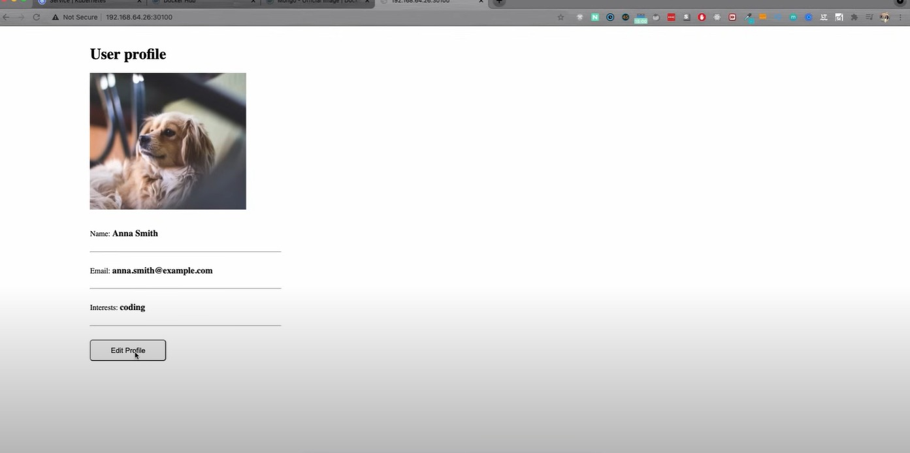

# 🚢 KUBERNETES

## 🧠 What?
It's an orchestration tool, to manage multiple containers.
- High availability
- Scalability
- Disaster recovery

## 🗄️ Architecture
- Master node
- Worker nodes (have the applications running)

### Master node
It has several Kubernetes processes:
- **API Server**: Entry point for the K8s cluster.
- **Controller Manager**: Tracks cluster state and performs corrective actions.
- **Scheduler**: Decides where Pods are placed.
- **etcd**: A key-value store that holds the cluster's state.

### Architecture in general
- Master nodes: 
  - Control plane nodes
  - Handful of master processes
  - Much more important
    - Use **1 master** for testing/dev, **3 or 5 masters** for production for high availability and quorum (must be odd for consensus)
- Worker nodes: 
  - Higher workload
  - Much bigger and more resources
  - Components:
    - **Kubelet:** Manages Pods locally and reports status to the master
    - **Kube Proxy:** Manages network routing using **iptables** to manage traffic between Pods

## 🥙 Kubernetes components

### List
- Node
- Pod
- Service
- Ingress
- ConfigMap
- Secret
- Deployment
- StatefulSet
- DaemonSet

### Node and Pod

**Node:**
- Virtual or physical machine
- Nodes can be:
  - Master nodes (control plane)
  - Worker nodes (where application Pods run)

**Pod:**
- Is the smallest unit in Kubernetes
- An abstraction over containers
- Usually 1 Application per Pod
- Each pod gets its own IP address
- Pods are **ephemeral** (They can die easily)
  - If a Pod dies, Kubernetes may replace it with a new Pod, which gets a new IP address.

### Service and Ingress

**Service:**
- **Permanent** IP address
- Lifecycle of Pod and Service not connected
  - If a Pod dies and is replaced, the Service ensures that the node IP does not change (it redirects to the new Pod)
- Acts as a **load balancer** for Pods behind it.

**Ingress:**

From `http://192.168.1.100:30001` to `https://my-app.com`
- Provides **external HTTP and HTTPS access** to services within the cluster.
- Transforms a cluster’s internal service into a user-friendly URL like `my-app.com`.
- **Acts like a reverse proxy**, routing traffic to the appropriate Service based on rules.
- While it provides domain-like URLs, it does not replace DNS:
  - The actual DNS for `my-app.com` must resolve to the cluster's Ingress Controller or Load Balancer IP.

### ConfigMap and Secret

**ConfigMap**
- External Configuration of your application
- ConfigMap is for non-confidentail data only!

**Secret**
- Used to store secret data
  - Passwords, certificates, credentials...
- They are just like confirMap but meant to use encryption by using third-party tools
- Reference Secret in Deployment/Pod

### Volume
- Attaches persistent storage to your Pod, ensuring data is retained even if the Pod restarts or dies.
- Useful for stateful applications, like databases, where data should not be lost.
- Storage can be located:
  - On the local node
  - Externally, outside the Kubernetes cluster

> Kubernetes doesn't manage data persistance!

### Deployment & StatefulSet

**Deployment**
- A Deployment is the **blueprint** for creating Pods (representing an application, e.g., `my-app`).
- Deployments abstract away the complexity of managing Pods directly:
  - **Pods** abstract containers.
  - **Deployments** abstract Pods.
- Key features:
  - **Replicas:** Defines the number of Pod replicas (e.g., 2).
  - **Selector:** Ensures that the Deployment manages Pods with specific labels (`app: my-app`).
  - **Template:** The Pod's template defines the container's image, environment variables, and exposed ports.

**StatefulSet**

- **StatefulSets** are designed for **stateful applications**, where data consistency and order are crucial, such as databases.
- Unlike Deployments, StatefulSets ensure that:
  - Each Pod has a unique, stable identity (e.g., pod-0, pod-1).
  - Pods are created, deleted, and scaled in a defined order.
  - Persistent storage is tied to specific Pods.
- Common use cases:
  - **Databases** like MySQL, PostgreSQL, MongoDB.
  - Ensures **read/write consistency** in databases.

> Note: StatefulSets can be more complex to deploy, so databases are often hosted outside the Kubernetes cluster for easier management.

## 🛠️ Kubernetes configuration
We send requests to the master node to configure Kubernetes using:
- **UI**, **API**, or **CLI**

Configuration files are written in:
- **YAML** or **JSON**

### YAML example:
```yaml
apiVersion: apps/v1
kind: Deployment
metadata:
  name: my-app-deployment
spec:
  replicas: 2
  selector:
    matchLabels:
      app: my-app
  template:
    metadata:
      labels:
        app: my-app
    spec:
      containers:
      - name: my-app
        image: my-image
        env:
          - name: SOME_ENV
            value: $SOME_ENV
        ports:
        - containerPort: 80
```

- **replicas:** Defines the number of Pod replicas (2 in this case)
- **selector** (Deployment's selector): Ensures the Deployment manages Pods with the specified labels(`app: my-app`)
- **template** (Pod's template): The template in Deployment is the blueprint to create Pods. Describes the Pods, including the container's image (`my-image`), the env variables(`SOME_ENV`) and exposed port(`80`).

### Parts of a K8s Configuration File:

Examples of `deployment` and `service` files:
```yaml
apiVersion: apps/v1
kind: Deployment
metadata:
  name: nginx-deployment
  labels: ...
spec:
  replicas: 2
  selectors: ...
  template: ...
```
```yaml
apiVersion: v1
kind: Service
metadata:
  name: nginx-service
spec:
  selector: ...
  ports: ...
```

Each configuration file has 3 parts:
1. **Metadata**: Includes information like the component's name and labels.
2. **Specification:** Defines the desired state, which varies by component type (e.g., replicas for Deployments, ports for Services).
3. **Status:** Automatically generated and added by Kubernetes.

### How `Status` work
Kubernetes continously compares the **desired state** (from YAML files) with the **current state** (tracked in `Status`).
- If there’s a mismatch, Kubernetes attempts to resolve it.
- Example:
  - Desired state: 2 replicas in the `Deployment`.
  - Current status: Only 1 replica is running.
  - Kubernetes identifies the difference and creates another replica to match the specification.

### Where `Status` Data Comes From

The Status data is stored in **etcd**, Kubernetes' key-value store.
- **etcd** holds the cluster's current state for all components.
- Kubernetes uses this data to track and manage the state of the cluster.

## 🧰 Minikube and kubectl
### Minikube and Kubectl

**Minikube:**

A tool to run Kubernetes locally on your machine. It creates a small, single-node Kubernetes cluster, perfect for learning and testing.

**kubectl:**

The command-line tool to interact with Kubernetes clusters. Use it to deploy applications, manage resources, and inspect the cluster's state.

### Cluster Setup (Minikube)
In a typical **production** cluster setup, you will have
- Multiple Master and Worker nodes run accross separate virtual or physical machines

However, for local testing, setting up such a complex cluster can be challenging.

**Minikube** simplifies this by running both master and worker processes on a single node.
This node also has Docker preinstalled, so you can run containers or Pods locally with ease, all in one compact environment.

### Kubectl
It's the **command line tool** for K8s cluster

One of the Master processes, the `Api Server`, is responsible for handling cluster interactions. . You can access the API Server through:
- UI
- API
- **CLI (`Kubectl`)**

Kubectl is the most powerful of these clients.

In a **minikube** setup, kubectl enables you to communicate not only with the master processes but also with the worker processes. This allows you to:
- Enable pods to run on the node
- Create and manage pods
- Create services
- Destroy pods
- And much more

> Note: Kubectl isn’t just for Minikube. It’s the primary tool to interact with any Kubernetes cluster setup, whether it’s Minikube or a production-grade cluster.

---

### 🚀 Setting Up Minikube
**Download**
- Download Minikube: [Click here](https://minikube.sigs.k8s.io/docs/start/?arch=%2Fwindows%2Fx86-64%2Fstable%2F.exe+download)
- Download Docker: [Click here](https://docs.docker.com/get-started/get-docker/)

### Start Minikube
1. Open your terminal or WSL

2. Run the following command to start Minikube with Docker as the driver:
   ```sh
   minikube start --driver docker
   ```

3. Check Minikube's status:
sh
Copy code: 
   ```sh
   minikube status
   ```

**Verify Kubectl**

When Minikube is installed, **kubectl** is also included as a dependency. Verify it’s working by running:
```sh
kubectl get node
```

## 😼 Create a Demo Project (1)
Our demo project will include a MongoDB database and a Web application.

### K8s Files Overview
We will create the following Kubernetes resources:
- **ConfigMap** (MongoDB Endpoint)
- **Secret** (MongoDB User & Password)
- **Deployment** (MongoDB Application)
- **Service** (Internal Service)
- **Deployment** (WebApp Application)
- **Service** (External Service)

Example Configuration Files:

### `mongo-config.yaml:`
```yaml
apiVersion: v1
kind: ConfigMap
metadata:
  name: mongo-config
data:
  mongo-url: mongo-service
```

### `mongo-secret.yaml:`
```yaml
apiVersion: v1
kind: Secret
metadata:
  name: mongo-secret
type: Opaque
data:
  mongo-user: bW9uZ291c2Vy
  mongo-password: bW9uZ29wYXNzd29yZA==
```
> Secrets use Base64-encoded strings. You can generate the encoded values like this:
> ```sh
> echo -n mongouser | base64
> # Output: bW9uZ291c2Vy
> echo -n mongopassword | base64
> # Output: bW9uZ29wYXNzd29yZA==
> ```
> **Note:** Base64 only encodes the data—it’s not encryption. While it helps obscure values, use Kubernetes-native encryption or external tools to safeguard sensitive information.


### `mongo.yaml:`

Deployment and Service can be defined in two separate files, but since they belong to the same application, we're combining both in one file in this example.

**1. Deployment:**

```yaml
apiVersion: apps/v1
kind: Deployment
metadata:
  name: mongo-deployment
  labels: # 1
    app: mongo
spec:
  replicas: 1
  selector:
    matchLabels: # 2
      app: mongo
  template:
    metadata:
      labels: # 3
        app: mongo
    spec:
      containers:
      - name: mongodb
        image: mongo:5.0
        ports:
        - containerPort: 27017
```

In this YAML code, the deployment specifies Pods, and each Pod contains a container.

- **Containers** (`spec.containers`): This part configures the container inside the Pod. It specifies the name (`mongodb`), image (`mongo:5.0`), and port (`27017`), the default for MongoDB.
- **Labels**:
  - **Label 1** (`metadata.labels`): Labels the Deployment with `app: mongo` for identification.
  - **Label 2** (`selector.matchLabels`): Binds to Label 3 inside the Pods, ensuring the Deployment manages Pods with the `app: mongo` label.
  - **Label 3** (`template.metadata.labels`): Labels the Pods with `app: mongo`, allowing the Deployment to find and manage them.
  ---
  - So, **Label 2** (the `matchLabels`) binds directly to **Label 3**(inside the Pod template), linking the Deployment to the Pods it controls.
> It is better to use a replica count of 1 in this case, because if you need multiple replicas for MongoDB, it's advisable to use a StatefulSet to preserve the state.

**2. Service:**
```yaml
---
apiVersion: v1
kind: Service
metadata:
  name: mongo-service
spec:
  selector:
    app: mongo
  ports:
    - protocol: TCP
      port: 27017
      targetPort: 27017
```
- `---`: This YAML separator is used to separate the Deployment and Service configurations within the same file.
- `selector.app`: Must match **Label 3** from the Pod template, ensuring that the Service connects to the correct Pods.
- `targetPort`: Must match the `containerPort` defined in the Deployment (i.e., `27017`).
- `port`: This is the port exposed by the Service to other Pods or external consumers. It doesn’t have to match `targetPort`, but we’ve kept it the same for simplicity.


### `webapp.yaml:`

Define both a **Deployment** and a **Service**, similar to **`mongo.yaml:`**

### **ENV**

Add environment variables from the secret (`mongo-secret`) and configMap (`mongo-config`) to both MongoDB Deployment and Webapp Deployment.

**1. Mongo Deployment ENV:**
```yaml
        env:
        - name: MONGO_INITDB_ROOT_USERNAME
          valueFrom:
            secretKeyRef:
              name: mongo-secret
              key: mongo-user
        - name: MONGO_INITDB_ROOT_PASSWORD
          valueFrom:
            secretKeyRef:
              name: mongo-secret
              key: mongo-password
```
This sets environment variables for MongoDB, pulling values from the `mongo-secret`. When the MongoDB container starts, it uses these credentials to create a user.

**2. Webapp Deployment ENV:**
```yaml
        env:
        - name: USER_NAME
          valueFrom:
            secretKeyRef:
              name: mongo-secret
              key: mongo-user
        - name: USER_PWD
          valueFrom:
            secretKeyRef:
              name: mongo-secret
              key: mongo-password
        - name: DB_URL
          valueFrom:
            configMapKeyRef:
              name: mongo-config
              key: mongo-url
```
Here we used both `mongo-secret` and `mongo-config`.

The advantage of doing it like this is that if we want to change any environment variable we don't have to modify anything in our deployments.

**3. Make Webapp Service external:**
```yaml
---
apiVersion: v1
kind: Service
metadata:
  name: webapp-service
spec:
  type: NodePort # Make it external
  selector:
    app: webapp
  ports:
    - protocol: TCP
      port: 3000
      targetPort: 3000
      nodePort: 30100 # Must set nodePort
```
- `type`: Defines the type of the port, default value is `ClusterIP` which is **internal**. But since we want ot be able to contact it from the browser, we need to use `NodePort` to make it **external**.
- `nodePort`: The port in the range **30000-32676** that will be exposed on the Node.
- Requests will have this format: `<NodeIP>:<NodePort>`.

With these configurations, you now have all the necessary files to deploy MongoDB and the Webapp, and expose the Webapp externally.

## 😼 Deploy a Demo Project (2)
Now that we have the configuration files prepared, we can proceed to create and deploy the components in Kubernetes.

### 1. Verify Minikube Cluster:
We can check that we have a  Minikube cluster running, but there are no components deployed yet:

```sh
kubectl get pod
# Output: No resources found in default namespace.
```

### 2. Create Components:
First, apply **ConfigMap** and **Secret** before creating the Deployments.

Use the `apply` command to manage Kubernetes resources from the configuration files (i.e., `kubectl apply -f <file-name.yaml>`):

```sh
kubectl apply -f mongo-config.yaml
kubectl apply -f mongo-secret.yaml
kubectl apply -f mongo.yaml
kubectl apply -f webapp.yaml
```
This will create all the required components for the project.

### 3. Check correct creation

**Command:**
```sh
kubectl get all
```

**Output:**
```js
NAME                                     READY   STATUS    RESTARTS   AGE
pod/mongo-deployment-798f55b8-c7nnk      1/1     Running   0          9m22s
pod/webapp-deployment-655ff6696b-fhr9v   1/1     Running   0          8m53s

NAME                     TYPE        CLUSTER-IP     EXTERNAL-IP   PORT(S)          AGE
service/kubernetes       ClusterIP   10.96.0.1      <none>        443/TCP          23h
service/mongo-service    ClusterIP   10.104.1.3     <none>        27017/TCP        9m22s
service/webapp-service   NodePort    10.96.220.85   <none>        3000:30100/TCP   8m53s

NAME                                READY   UP-TO-DATE   AVAILABLE   AGE
deployment.apps/mongo-deployment    1/1     1            1           9m22s
deployment.apps/webapp-deployment   1/1     1            1           8m53s

NAME                                           DESIRED   CURRENT   READY   AGE
replicaset.apps/mongo-deployment-798f55b8      1         1         1       9m22s
replicaset.apps/webapp-deployment-655ff6696b   1         1         1       8m53s
```
You should see `Pods`, `Services`, `Deployments` and a replica for each `Deployment`.

To see additional resources such as `ConfigMaps` and `Secrets`, you can use:

```sh
kubectl get pod | configmap | secret | ...
```

### 4. Other `kubectl` commands

Also as documentation for `kubectl` commands, use:
```sh
kubectl --help
```

To get more specific help for a particular command, such as **get**:
```sh
kubectl get --help
```

If you want more detailed information than **get** provides, use the **describe** command:
```sh
kubectl describe service <service-name>
```

You can view logs from a pod with the following command (use the `-f` flag to stream logs):
```sh
kubectl logs <podName> -f
```

## 😼 See Demo Project in Browser (3)

To access the demo project in the browser, we'll obtain the port from the service and the IP from the Minikube machine.

### 1. Get Service Information:
**Command:**
```sh
kubectl get service
```

**Output:**
```js
NAME             TYPE        CLUSTER-IP     EXTERNAL-IP   PORT(S)          AGE
kubernetes       ClusterIP   10.96.0.1      <none>        443/TCP          23h
mongo-service    ClusterIP   10.104.1.3     <none>        27017/TCP        33m
webapp-service   NodePort    10.96.220.85   <none>        3000:30100/TCP   33m
```
Here, the webapp-service is exposed on port `30100`.

### 2. Get Minikube IP:
**Command:**
```sh
minikube ip

# Other option; since `kubectl get node` is Minikube 
kubectl get node -o wide 
```

**Output:**
```js
192.168.49.2
```
Here, `192.168.49.2` is the Minikube IP.

### 3. Open the Demo Project:
Now, combine the Minikube IP and the port to access the demo project:
```css
http://192.168.49.2:30100/
```

> **Note**: This will only work if Kubernetes is running locally on your computer. If you're using WSL or another environment, see the next section for alternative instructions.

## 😼 [Alternative] Access Demo Project from WSL (3: Part 2)
If you cannot access your Kubernetes cluster directly (e.g., it's deployed in **WSL**), you can use `curl` to quickly check the service or use `port-forward` for a more interactive local access.

### 1. Check with `curl`:
Obtain the **Service port** and **Node IP** like explained in section: **😼 See Demo Project in Browser (3)**, then run:

```css
curl http://192.168.49.2:30100/
```

### 2 Access with `port-forward`:
Service’s `port` is **3000**. Let's map it to a local port (e.g., 8080) with `port-forward` for testing: 
```sh
kubectl port-forward service/webapp-service 8080:3000
```
> `port-forward` is great for temporary access during **testing or debugging**. It works with pods or services, but using it with services is recommended as they provide a stable endpoint. For long-term access, it's more standard to use options like **`nodePort`** or **`ingress`**.

### 3 Open the Demo Project:
After setting up `port-forward`, access the project at:
```css
http://localhost:8080
```

## 📷 Image

Enjoy your fully integrated page with a database! 🥳🥳



## Resources:
- **Kubernetes Crash Course** (1 Hour): [Click here](https://www.youtube.com/watch?v=s_o8dwzRlu4)