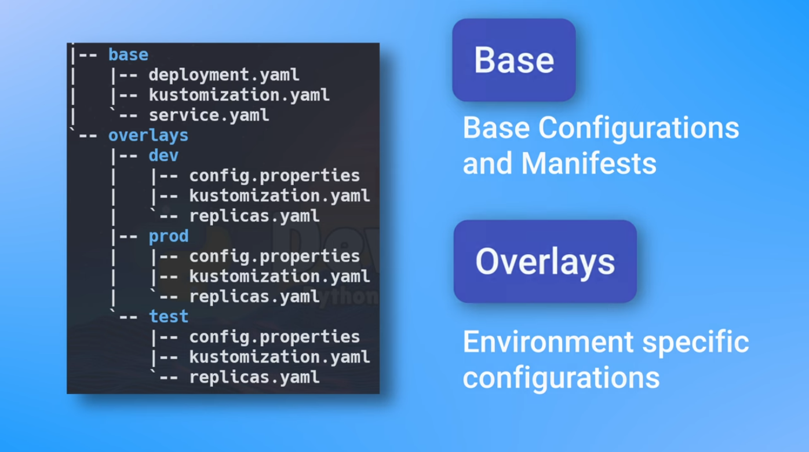
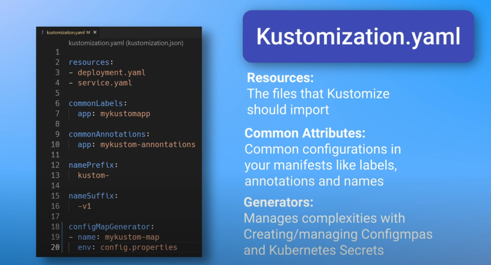
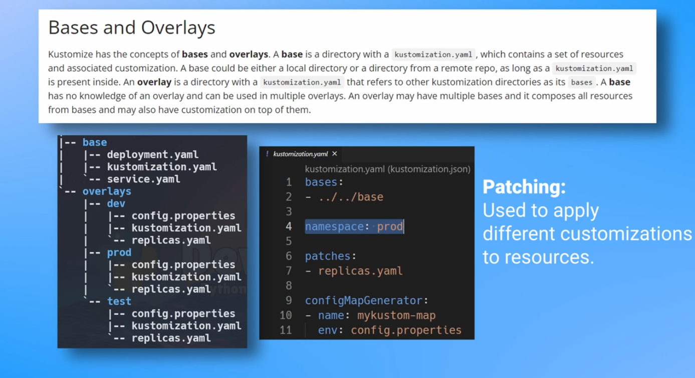

<!-- https://www.youtube.com/watch?v=spCdNeNCuFU -->

# 🚢 KUBERNETES 4 (Kustomize)
Kustomize is a kubernetes native tool for **customizing k8s manifest files**. It doesn't require any complex templating or additional tools.

## 🧠 Why use kustomize?
- Simplify configuration of config files, and provides handy methods like generators to make customization easier.
- Multiple environments (patching and overlays)
- Easy to use

**Example of files structure with different environments:**


**Example of `kustomization.yaml`:**



## Apply Kustomize
**If you want to see the raw `yaml` files that will be created with your kustomization, use `kubectl kustomize`**
```sh
kubectl kustomize <directory-with-kustomization.yaml>

# To also apply it:
kubectl kustomize <directory-with-kustomization.yaml> | kubectl apply -f - --server-side
```

**Or you can apply it directly with `kubectl apply -k`**

```sh
kubectl apply -k <directory>
# It's the same as 'kustomize' + 'apply -f'
```
