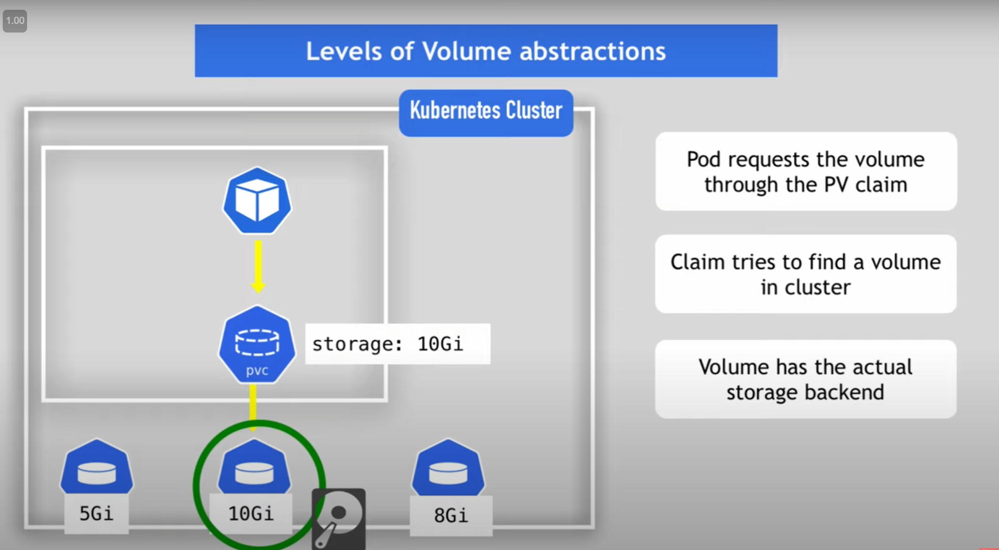
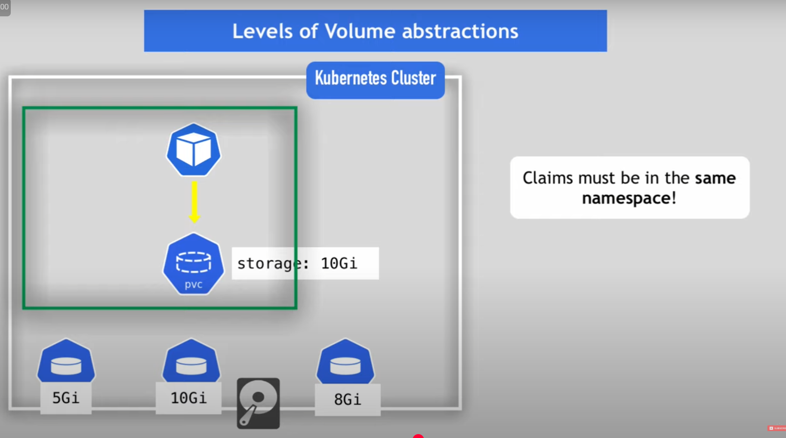
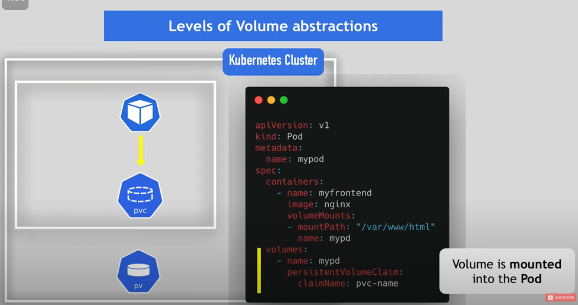
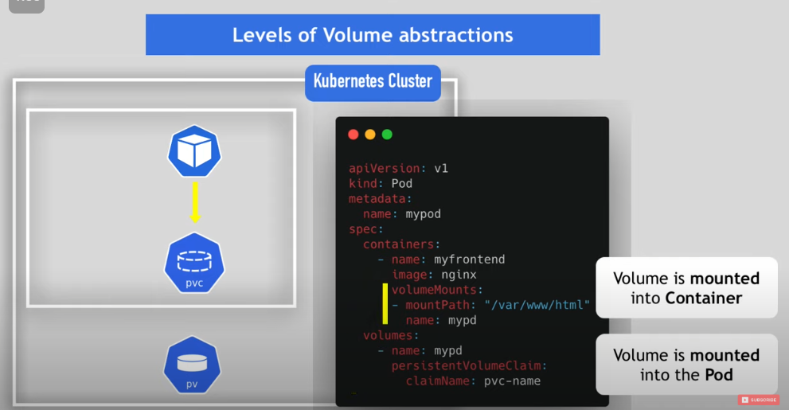
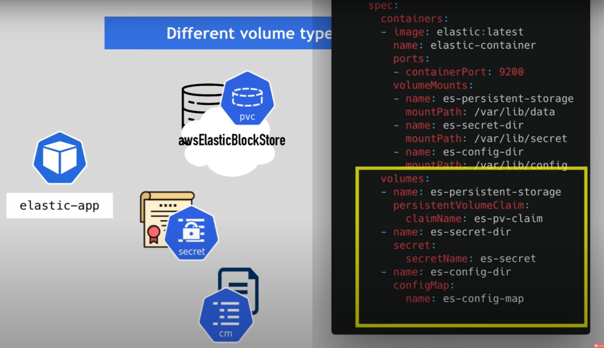
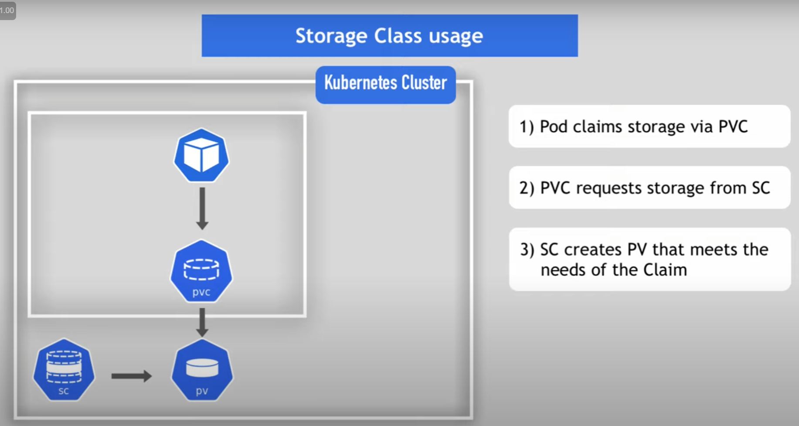

<!-- https://www.youtube.com/watch?v=0swOh5C3OVM -->

## 🚢 Volumes in k8s (PV, PVC, SC...)
To persist data in K8s using volumes, we will see the following components:
- **Persistent Volume**
- **Persistent Volume Claim**
- **Storage Class**

### 🧠 Why?
Imagine you have 2 pods: `my-app` and `mysql`. With `my-app` you add and update data to the db `mysql`. 

However, by default, when you restart the `mysql` pod, all those changes get lost. This is because, **Kubernetes doesn't provide data persistence out of the box**, you need to configure that for each application that needs saving data between pods restart.

### 🫙 Storage requirements
For this, 1. you need to have storage that **doesn't depend on the pod lifecycle**.

However, you don't know from which node will the pod restart in. 2. So the storage must be **available to all nodes***. 

And, 3. Storage needs to **survive** even if **cluster crashes**.

<small> *Minikube has by default only one node that acts as both master and worker. You can try commands: `kubectl get nodes` and `minikube node add`</small>

### Another use case for persistent storage
Instead of a database, it can also be used for persistent storage, e.g. `my-app` writes/reads from a file or folder (e.g. about the app configuration, session data, etc).

> About the resilience of the information, whether using just a PV, or also PVCs, there are 2 types.
> - **Local storage:** data is tied to a specific node. Data will survive a pod fail 👍, but not a node fail 👎 (This violates principles 2 and 3 of *🫙 Storage requirements*)
> - **Cloud/Network storage:** data resides on a external storage, and different nodes can access it. Data will survive a pod fail 👍, and will survive a node fail 👍. (No violations. Recommended in most scenarios)

## 📦💾 PersistentVolume
PersistentVolume is a cluster resource, just like RAM or CPU, that is used to store data. And it's created via a YAML file. Example:

```yaml
apiVersion: v1
kind: PersistentVolume
metadata:
  name: pv-name
spec:
  capacity:
    storage: 5Gi
  volumeMode: Filesystem
  accessModes:
    - ReadWriteOnce
  persistentVolumeReclaimPolicy: Recycle
  storageClassName: slow
```

PV is an abstraction and needs actual physical storage, like:
- local harddrive inside the cluster
- external nfs server outside of the cluster
- external cloud storage

I will show a example of each with yaml at the end**

Also, kubernetes does not care about the actual specifications of your pysical storage, so it's the kubernetes maintainer who  has to take care of taking backups of the physical storage, making sure that the data does not get corrupted and so on.

Also, Persistent Volumes are **not namespaced** (unlike pods, services, ...), this means that persistent volumes are accesible to the whole cluster.

---
**
**1. Local harddrive inside the cluster**
<small>
```yaml
apiVersion: v1
kind: PersistentVolume
metadata:
  name: pv-local
spec:
  capacity:
    storage: 5Gi
  volumeMode: Filesystem
  accessModes:
    - ReadWriteOnce
  persistentVolumeReclaimPolicy: Delete
  storageClassName: local-storage
  local:
    path: /mnt/disks/ssd1
  nodeAffinity:
    required:
      nodeSelectorTerms:
      - matchExpressions:
        - key: kubernetes.io/hostname
          operator: In
          values:
          - worker-node-1
```
</small>

**2. External NFS server outside of the cluster**
<small>
```yaml
apiVersion: v1
kind: PersistentVolume
metadata:
  name: pv-nfs
spec:
  capacity:
    storage: 5Gi
  volumeMode: Filesystem
  accessModes:
    - ReadWriteOnce
  persistentVolumeReclaimPolicy: Recycle
  storageClassName: slow
  mountOptions:
    - hard
    - nfsvers=4.0
  nfs:
    path: /dir/path/on/nfs/server
    server: nfs-server-ip-address
```
</small>

**3. External cloud storage (Google Cloud example)**
<small>
```yaml
apiVersion: v1
kind: PersistentVolume
metadata:
  name: pv-cloud
  labels:
    failure-domain.beta.kubernetes.io/zone: us-central1-a__us-central1-b
spec:
  capacity:
    storage: 400Gi
  accessModes:
    - ReadWriteOnce
  gcePersisntentDisk:
    pdName: my-data-disk
    fsType: ext4
```
</small>

## K8s Administrator and K8s user

PV are resources that need to be there **BEFORE** the pod that depends on them is created. 

In some teams it can be interesting to divide the k8s work between the k8s administrator and the k8s developer.  

- K8s administrator sets up the cluster and maintains it
- K8s User deploys applications in cluster

So the K8s administrator may create the nfs-storage/cloud-storage and the PV components for this storage.

Following this example, the K8s developer has the role of making their application **claim** the Persistent Volume

## 🛄📝 PersistentVolumeClaim
To do this, there is another Kubernetes component called PersistentVolumeClaim. Example:

```yaml
kind: PersistentVolumeClaim
apiVersion: v1
metadata:
  name: pvc-name
spec:
  storageClassName: manual
  volumeMode: Filesystem
  accessModes:
    - ReadWriteOnce
  resources:
    requests:
      storage: 10Gi
```

The way that this works, is that the PVC claims volumes with a specific type like the storage, and accessModes. And whatever PersistentVolume that matches this criteria will be used (they need to be created beforehand).

Not only you need to create the PersistentVolumeClaim file, but you also need to use that PVC in the Pods configuration, like this:

```yaml
apiVersion: v1
kind: Pod
metadata:
  name: mypod
spec:
  containers:
    - name: myfrontend
      image: nginx
      volumeMounts:
      - mountPath: "/var/www/html"
        name: mypd
  volumes:
    - name: mypd
      persistentVolumeClaim:
        claimName: pvc-name
```

---
So, for example as you can see in the following image, the pod requests the Volume through the PV Claim. The Claim tries to find a volume in the cluster. These Volumes need to be defined from before. And it is in the Volume where the actual storage backend resides.



Notice also that the **PVC must be in the same namespace**. While the Volumes are not in the same namespace.


---
Once the pod is able to find the Volume through the PVC. That Volume is **mounted** into the **Pod**. And then, that volume is **mounted** into **Container**. As you can see in the following two images.

Also, if you have several containers inside the pod, you can choose which ones of them will use the volume. 

Now the container(or the application inside the container) can read/write to the storage. And when the pod dies, and a new one is created, it will have access to the same storage, and see all changes that the previous pods or containers made.




## Why so many abstractions?
- The admin role is to provision storage resources (PV)
- And the developer creates claim to PV

This has the advantage for the developer that you deploy the application in the cluster, and you don't know where the actual storage is, it could be in a NFS or in a cloud storage like AWS, but it doesn't matter for you as long as the data is correctly stored and has enough space.

So it makes deploying the application easier for developers

## ConfigMap and Secret
- Local volumes
- Not created via PV and PVC
- Managed by Kubernetes

Steps:
1) Create ConfigMap and/or Secret component
2) Mount that into your pod/container

```yaml
apiVersion: v1
kind: Pod
metadata:
  name: mypod
spec:
  containers:
    - name: busybox-container
      image: busybox
      volumeMounts:
        - name: config-dir
          mountPath: /etc/config
  volumes:
    - name: config-dir
      configMap:
        name: bb-configmap
```

## Different volume types in a Pod
In the `volumes` section you have different volumes, and you can mount each one into a different path inside the container (`containers.volumeMounts` section).



---

As we have seen until now,
1. Adminst configure storage
2. and Create Persistent Volumes
3. K8s developers claim PV using PVC

Thus, k8s developers have to request new storage to the admins, who have to ask for new physical storage to the cloud etc to build the PVs. **And this can end up being tidy, and chaotic.**

**To make this process more efficient**, there is a third K8s persistence component: **StorageClass**

## 🏫🧑‍🏫 StorageClass

SC provisions Persistent Volumes dynamically when PersistentVolumeClaim claims it. Example:

```yaml
apiVersion: storage.k8s.io/v1
kind: StorageClass
metadata:
  name: storage-class-name
provisioner: kubernetes.io/aws-ebs
parameteres:
  type: io1
  iopsPerGB: "10"
  fsType: ext4
``` 

- `kind: StorageClass`
- StorageBackend is defined in the SC component via `provisioner` attribute. 
  - Each storage backend has its own provisioner
  - **internal** provisioner - "kubernetes.io"
  - **external** provisioner
- Configure `parameters` for storage we want to request for PV

So, the SC is another abstraction level that:
- abstracts the underlying storage provider
- abstracts the paramaters for that storage

**Storage Class usage:**

Requested by **PersistentVolumeClaim**, similar to how we **Claim** the **Volumes**, in this case we **Claim** the **SC**. Example of PVC:

```yaml
apiVersion: v1
kind: PersistentVolumeClaim
metadata:
  name: mypvc
spec: 
  accessModes:
  - ReadWriteOnce
  resources:
    requests:
      storage: 100Gi
  storageClassName: storage-class-name
```

It's important that in `spec.storageClassName` must be referenced the name of the `StorageClass`.

---

Now, when **1. a pod claims storage via PVC, 2. the PVC requests storage from SC, 3. SC creates a PV that meets the needs of the Claim.**


<small>Small square is the namespace. Big square is the cluster.</small>


## 📙 Resource
- This [video from Nana](https://www.youtube.com/watch?v=0swOh5C3OVM)