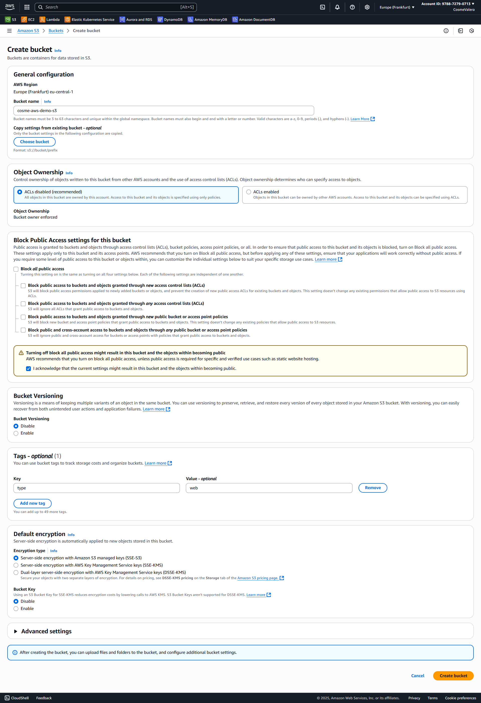

<!-- https://www.youtube.com/watch?v=zQyrhjEAqLs -->

# ☁️ AWS (Midu tutorial)

## 🤔 Why?
Amazon Web Services (AWS) is the world’s most comprehensive and broadly adopted cloud. It counts with +200 different services, for things like: servers, databases, object storage, user management and more.

### 🗂️ Quick scheme with the most important services
| AWS Service   | What it is / What it’s for                           | Equivalent you may know                         |
|---------------|------------------------------------------------------|------------------------------------------------|
| **EC2**       | Scalable virtual servers in the cloud                | Like renting a server from a hosting provider (Blacknight, OVH) where you install Apache, Nginx, Docker, etc.  |
| **S3**        | Object storage (files, backups, static assets) via API | Google Drive for apps / MinIO bucket           |
| **RDS**       | Managed relational databases (MySQL, Postgres, etc.) | MySQL/Postgres on a server, but auto-managed   |
| **EKS**       | Managed Kubernetes service                           | Minikube / RKE2 cluster on your machine        |
| **Lambda**    | Run code on demand without managing servers (serverless) | Cron/event-driven script, but in the cloud     |
| **CloudFormation** | Infrastructure as code definition. Define AWS resources (servers, DBs, buckets) as code, auto-create them.   | Terraform (similar), not like Ansible/Rundeck  |

### ↕️ Vertical scaling vs ↔️ horizontal scaling
- **Vertical scaling**: Add more power (CPU/RAM) to a single server.  
  - Pros: simpler, cheaper, usually better cost efficiency.  
  - Cons: downtime when upgrading.  

- **Horizontal scaling**: Add more servers to handle load.  
  - Pros: no downtime.  
  - Cons: more complex, more expensive.  

## 🥰 Services

### 😊 EC2 (Elastic Compute Cloud)

Example configuration of a demo for EC2

Once the EC2 instance has been launched, we can see it if we go to the instances page:

For example, the public address is: `18.185.48.185`. Although if we open it right now, it doesn't show anything. We will see how to make it work in the next section.

**How to connect to the EC2 machine**

1. Click on the button **Connect**
2. Go to **SSH client**
3. Copy the command

4. Apply chmod restrictions to the `.pem` file: 
   1. `chmod 400 ~/.ssh/cosme-demo-ssh.pem`
   2. In windows, you might have to copy the `.pem` file into inside the WSL (as you can see in the next picture).
5. Execute the command to connect with ssh to the EC2 instance.

6. We configure a server with python inside the EC2 instance.

7. We can now connect to the server (make sure to use **http** in the URL since we are using port 80 for the server!)

---

The following services are 🗄️ **Database services.** And we will see a practical example with **RDS (Relational Database Service).**

### 🗄️ DocumentDB 📚
**Summary: MongoDB like Database Service.** | - - - - - |
DocumentDB is a document database service designed to be compatible with MongoDB. It allows developers to store, query, and index JSON-like data at scale.

### 🗄️ DynamoDB ⚡
**Summary: Key-Value and Document NoSQL Database.** | - - - - - |
DynamoDB is a NoSQL database. It supports both key-value and document data models. It is very fast; can be used for low-latency games, or real-time analytics apps.

### 🗄️ MemoryDB 🤓
**Summary: Redis like Service.** | - - - - - |
MemoryDB is a Redis-compatible in-memory database service that stores data in RAM for ultra-fast access, ideal for caching and real-time applications.

### 🗄️ RDS (Relational Database Service)

### 🪣 S3 (Simple Storage Service)

S3 inspired MinIO. Both of them are based on buckets and objects. Objects are static files like images, videos, documents, etc.

S3 is very cheap.

Instead of exposing eveything directly from S3, there is another AWS called CloudFront, that acts like a CDN.

Once it's created we can access it, and create our first objects. Click in the bucket, and then in crete folder.

And now we want to add an image to our folder, first we click on upload, and then we drop the image that we want to store:

However, if we click the Object URL directly to open the image, it is not available. We need to add a policy to the bucket to say who to allow to access it and so on, for now we'll say that anyone can access anything:

### 🔐 IAM (Identity and Access Management)
IAM manages who can access what in your AWS account. It controls users, permissions, and security policies. We will use it to gain access to the webpage we will deploy.

Let's create an user, and say that it can do anything he wants with S3. Also, let's give the user permission to access to aws through a terminal.

Now we have the access key and the secret. We can use the terminal with the client of AWS: `aws`. First, we have to install it. And then we add the key and secret from the IAM.

Now we can go to one of our repositories, to sync the S3, with one of out `dist` or `public` folder projects. To store our repo built project in S3 of AWS, using this command: `aws s3 sync ./public/ s3://cosme-aws-demo-s3`, where *cosme-aws-demo-s3* is the name of our S3.

Great, we have our webpage hosted with S3 🥳🥳

🤔 Notice how you need to add `/index.html` at the end of the URL for it to work. Let's optimize this for static website pages like this one. So we don't need to add it.

Let's go to properties of the bucket and the last property is for this. Click **Edit** to **Static website hosting**:

Then you have to enable it. Set index.html as the index document. Add an error Document if applicable. And you can add redirection rules if you want.

S3 static website hosting automatically handles directory-style routing. When someone visits `/about`, S3 will automatically look for `/about/index.html`. Redirection rules are useful for more specific cases like redirecting old URLs to new ones, handling custom URL patterns, or complex routing scenarios.

It's important to notice, that there is a new url for the static webpage. In this case:
- Object URL: `https://cosme-aws-demo-s3.s3.eu-central-1.amazonaws.com/`
- Website URL: `http://cosme-aws-demo-s3.s3-website.eu-central-1.amazonaws.com`

Notice the `s3-website` part in the correct URL!

