<!-- https://gmv.udemy.com/course/jenkins-masterclass/learn/lecture/23825024#overview -->

# 🛠️ JENKINS

## 🤔 Why jenkins?
Jenkins is the most popular tool for automatizing CI/CD processes. 

- **CI** *(Continuous Integration)*: 
  - Build
  - Test
- **CD** *(Continuous Delivery/Deployment)*:
  - Build Docker images
  - Push images to registry
  - Deploy Kubernetes

## 🐋 Installation
For this course we will install it with 🐋 Docker.

Usage:
```sh
docker run -p 8080:8080 -p 50000:50000 --restart=on-failure -v jenkins_home:/var/jenkins_home jenkins/jenkins:lts-jdk17
```

> Links-> [Github page of Jenkins Docker](https://github.com/jenkinsci/docker), [DockerHub page of the Jenkins Docker image](https://hub.docker.com/r/jenkins/jenkins).

### 👷 Setting up our first Jenkins Job
Click create new Item. Give it a name, and add a shell script in the Build Steps to check that the echo is been applied in the Console Output 😊.


### ⛓️ Setting up our first pipeline
We store the content of the pipeline in our [Jenkinsfile](Jenkinsfile).

Which looks like this:
```py
pipeline {
    agent any
    
    stages {
        stage("Clean Up") {
            steps {
                deleteDir()
            }
        }
        stage(...) {
          ...
        }
    }
}
```

I create a new Pipeline called *My Pipeline* with the script of my Jenkinsfile, and click play. Each stage corresponds a stage in the visualization (test, build...).


**Useful links:**
- [Pipeline Syntax](https://www.jenkins.io/doc/book/pipeline/syntax/)
- [Pipeline Basic Steps](https://www.jenkins.io/doc/pipeline/steps/workflow-basic-steps/)

**Replay**

Also, for debugging *'Replay'* is a good idea to make quick changes to the pipeline.

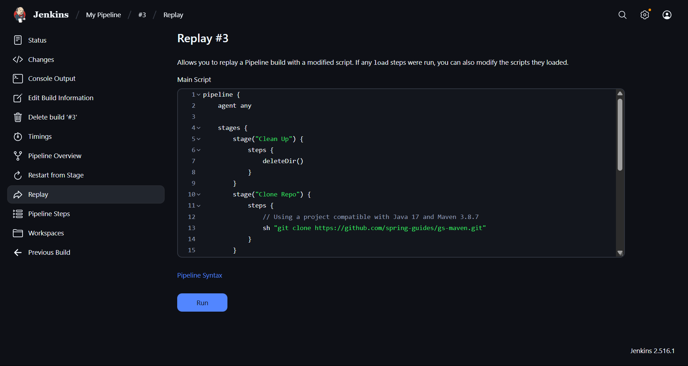

### 😎 Configure pipeline using the jenkinsfile from your repo
- Definition -> Pipeline script from SCM
- SCM -> Git
- Select the Repository Url
- Select the branch
- Select the Script path

Now it is configured with one first extra step called "Checkout SCM", it will clone the repo the first time, and then it will pull the branch every time that a change happens, or do nothing if no commit is added.

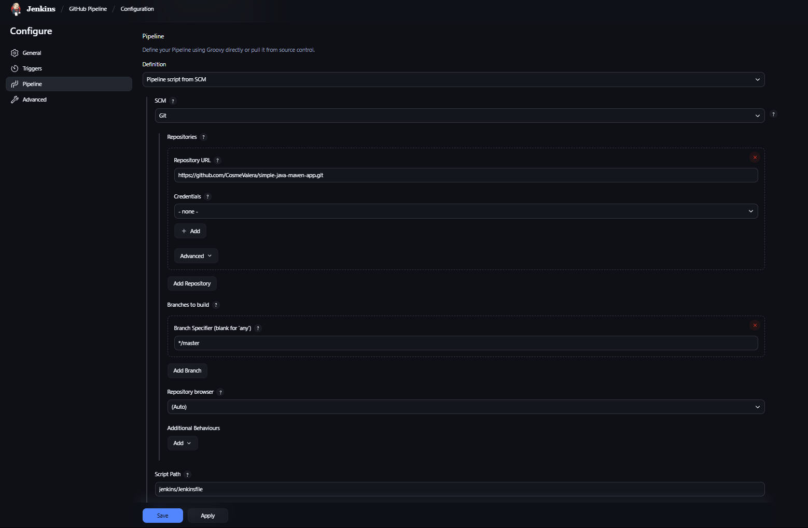

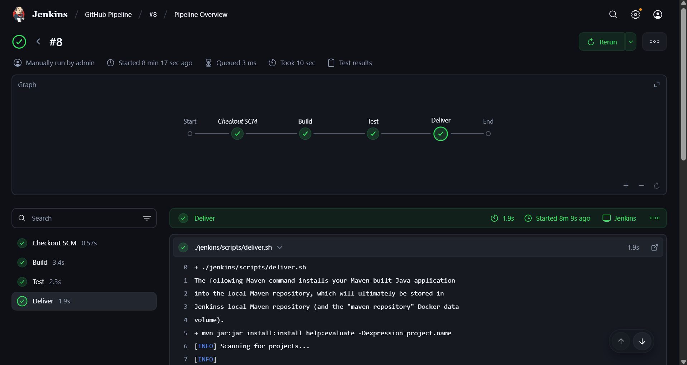

### 👌 Polling SCM: automatic build job when a commit happens

Add Poll SCM to make Jenkins check the repo periodically, in case of a new commit, it will run automatically the build job. For how often you want Jenkins to check the repo, you have to define it with a CRON schedule expressions `[1]`.

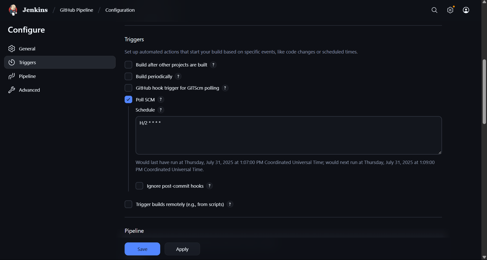
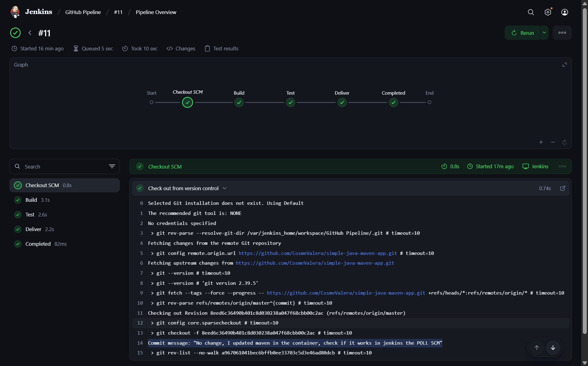
*Commit message: "No change, I updated maven in the container, check if it works in jenkins the POLL SCM"*

> `[1]` **CRON schedule expressions**
>
> Visit https://crontab.guru/ to learn about it.
>
> **EXAMPLE:**
> 
> `H/2 * * * *` means every 2 minutes.
>
> The `H` means that it will be at different offset times. 
> - `2 * * * *`: Every job polls at exactly 00:00, 00:02, 00:04, 00:06, etc.
> - `H/2 * * * *`: Each job polls every 2 minutes, but at different offset times 00:01:34, 00:03:34, 00:05:34, etc.


### ⛓️⛓️ Multi branch pipeline
Similar to the pipeline job, but it works with all branches.

Add the project repository, the path to the jenkinsfile, and the periodicity of the checks (if you want).
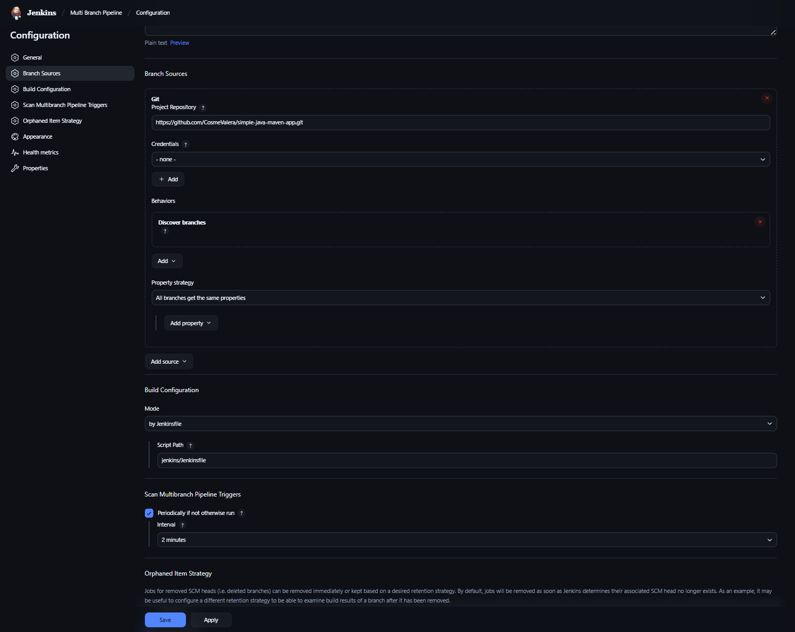
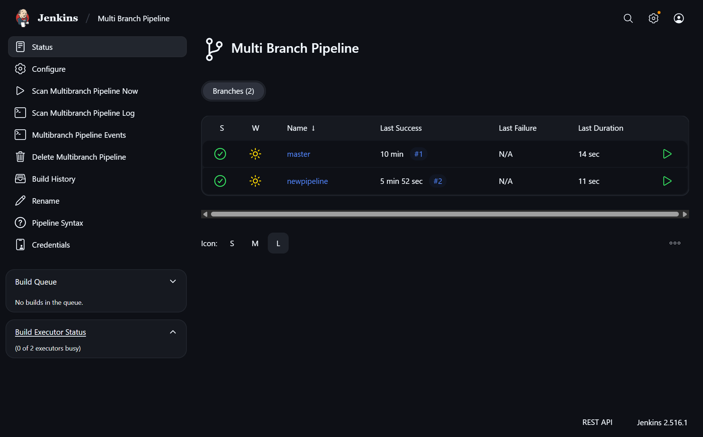
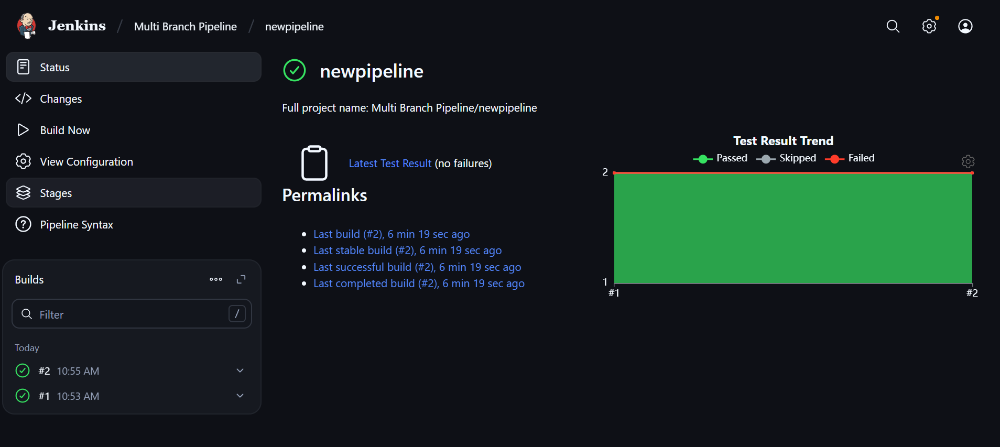
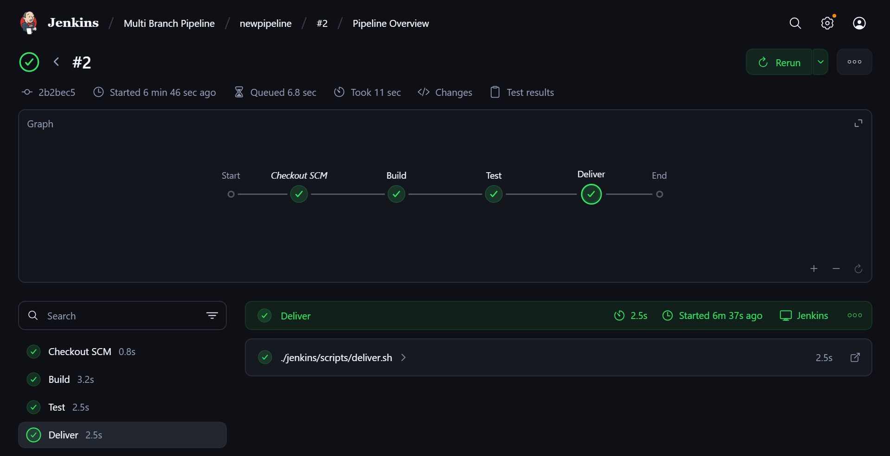

### 👉 Parameterized Pipelines
You can configure to check for parameters like this (check folder `/params/`):

**Boolean**
```py
pipeline {
  agent any

  parameters {
    booleanParam(defaultValue: false, description: "Enable service?", name: "myBoolean")
  }

  stages {
    stage("Demo") {
      steps {
        echo "booleanParam is set to: ${params.myBoolean}"
      }
    }
  }
}
```
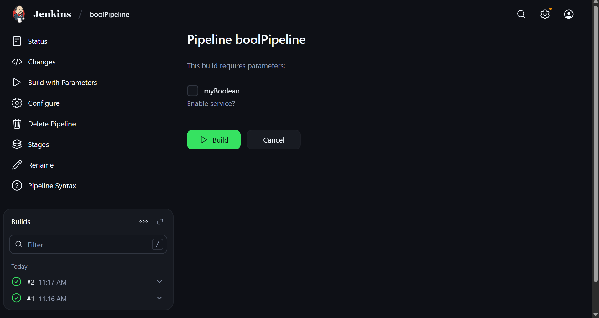
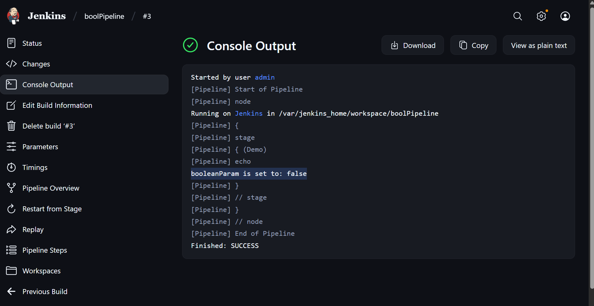

**String**

Ask for user input.

```py
pipeline {
  agent any

  parameters {
    string(defaultValue: "TEST", description: "Which environment to deploy in?", name: "deployEnv")
  }

  stages {...}
}
```
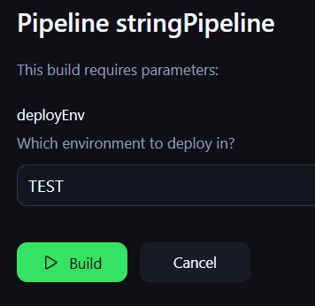
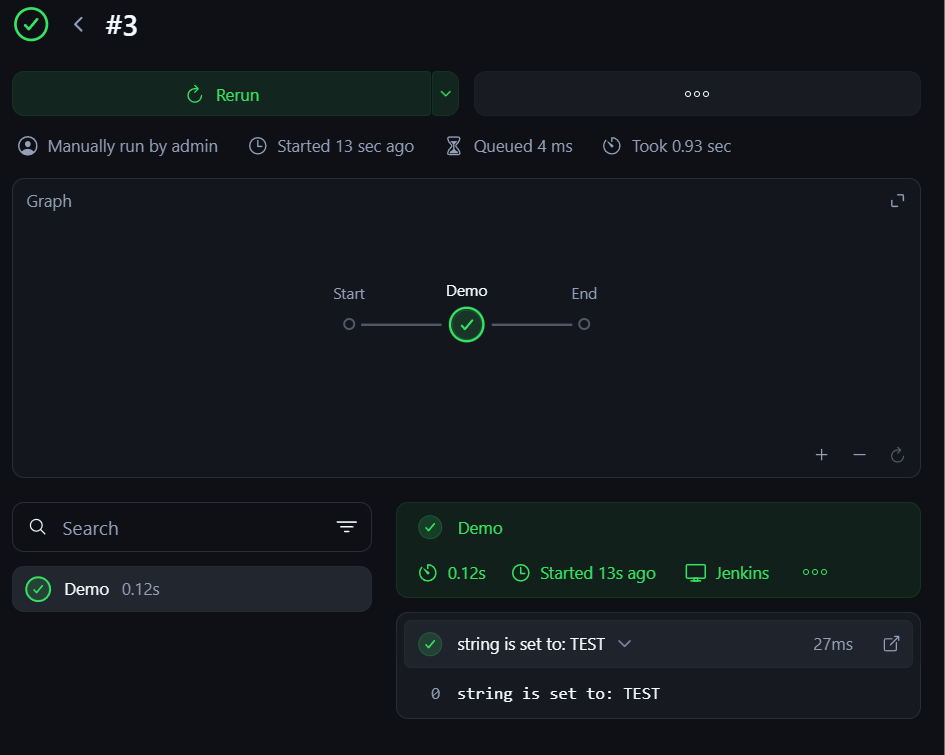

Also, you can check which parameters where used in a specific build, by clicking on **Parameters*.*
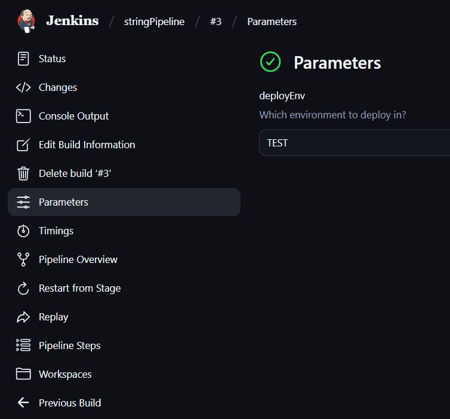

**Choice**

In a similar way with `choice` you can predefine an array of options.
```py
pipeline {
  agent any

  parameters {
    choice(choices: ["TEST", "DEV", "QA", "PRE-PROD", "PROD"], description: "Which environment to deploy in?", name: "deployEnv")
  }
  
  stages {...}
}
```

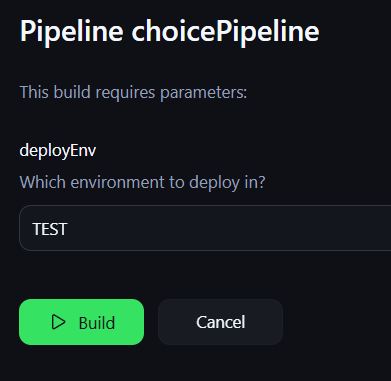
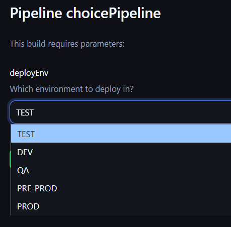


### 😊 Variables
.