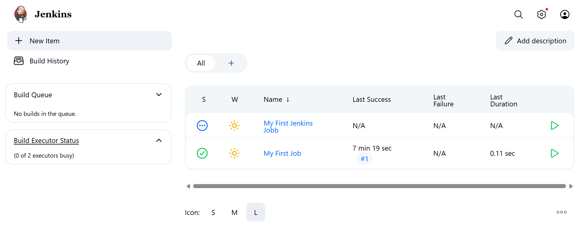
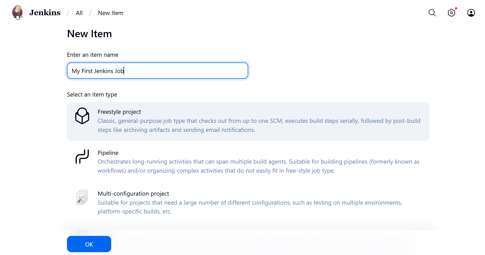
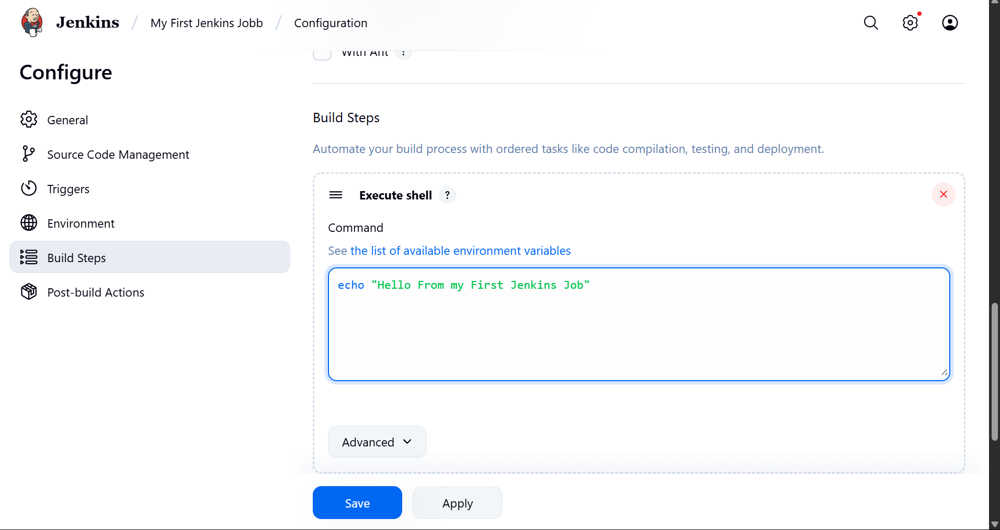
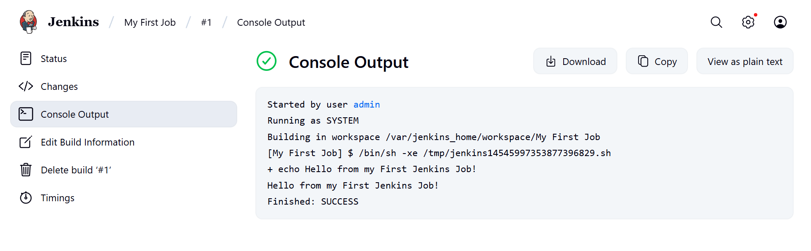
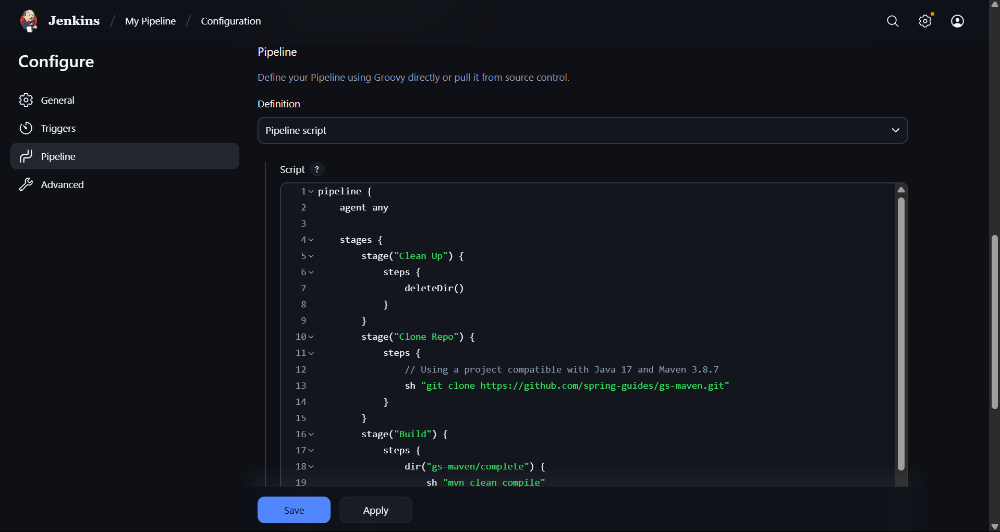
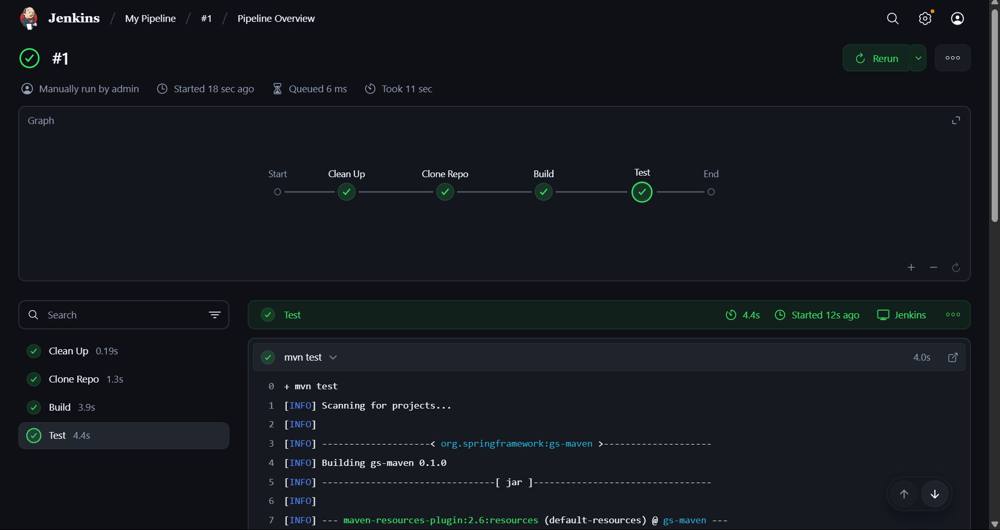

<!-- https://gmv.udemy.com/course/jenkins-masterclass/learn/lecture/23825024#overview -->

# 🛠️ JENKINS

## 🤔 Why jenkins?
Jenkins is the most popular tool for automatizing CI/CD processes. 

- **CI** *(Continuous Integration)*: 
  - Build
  - Test
- **CD** *(Continuous Delivery/Deployment)*:
  - Build Docker images
  - Push images to registry
  - Deploy Kubernetes

## 🐋 Installation
For this course we will install it with 🐋 Docker.

Usage:
```sh
docker run -p 8080:8080 -p 50000:50000 --restart=on-failure -v jenkins_home:/var/jenkins_home jenkins/jenkins:lts-jdk17
```

> Links-> [Github page of Jenkins Docker](https://github.com/jenkinsci/docker), [DockerHub page of the Jenkins Docker image](https://hub.docker.com/r/jenkins/jenkins).

### 👷 Setting up our first Jenkins Job
Click create new Item. Give it a name, and add a shell script in the Build Steps to check that the echo is been applied in the Console Output😊.






### ⛓️ Setting up our first pipeline
We store the content of the pipeline in our [Jenkinsfile](Jenkinsfile).

Which looks like this:
```py
pipeline {
    agent any
    
    stages {
        stage("Clean Up") {
            steps {
                deleteDir()
            }
        }
        stage(...) {
          ...
        }
    }
}
```

I create a new Pipeline called *My Pipeline* with the script of my Jenkinsfile, and click play. Each stage corresponds a stage in the visualization (test, build...).




### Other
.