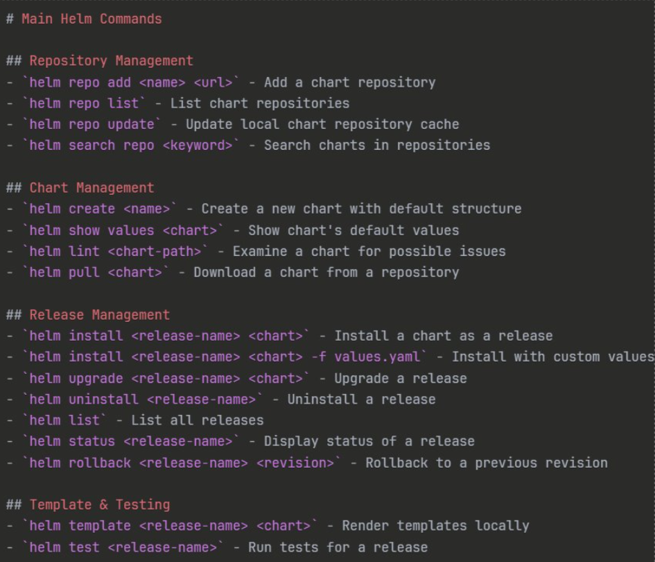
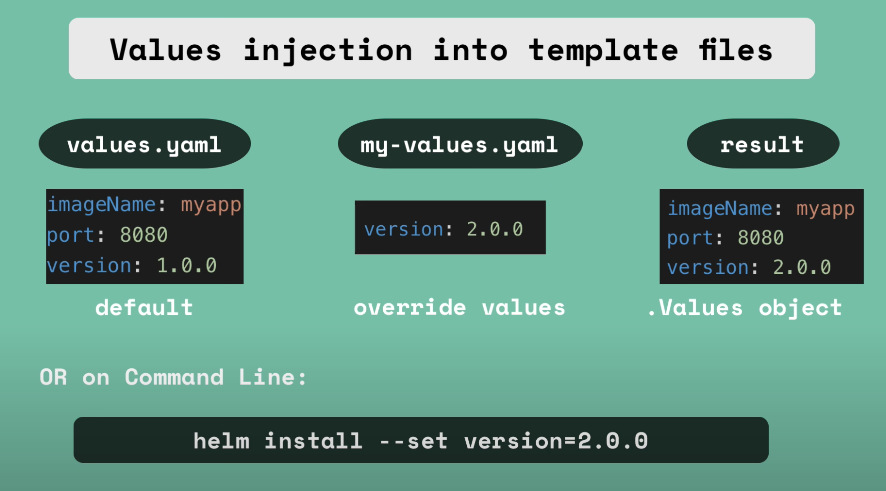

<!-- https://gmv.udemy.com/course/3231011/enroll/ -->

# 🚢 HELM
Helm is a package manager for kubernetes like apt or zypper. Install Helm: [Click here](https://helm.sh/). Explore Helm Charts: [Artifact Hub](https://artifacthub.io/).

## 📋 Main Helm commands



## 📦 Helm get and 📋 Helm Show
The `helm get` command allows you to retrieve information about a deployed release. 
The `helm show` command helps you examine a chart before installation.

**Example**
```sh
# helm get [command] <release_name>
helm get manifest my-release # Show the K8s manifests

# helm show [command] <chart_name>
helm show chart bitnami/apache # Show chart definition
```

**Combined with grep**
```sh
# If you want to see the content of your current ingress. In this case -A 50 shows the 50 next lines, you can change the number at will
helm get manifest my-release | grep -A 50 "kind: Ingress"
helm get manifest my-release | grep -A 50 "kind: Deployment"
```

> To see everything about `helm get` and `helm show` go to -> [README-5-2](./2-commands-repos-and-charts/README-5-2.md)

## 📝 Helm Upgrade

The `helm upgrade` command is used to modify or upgrade a release. Here are the essential commands:

**Helm upgrade**
```bash
# Upgrade with another values file
helm upgrade apache1 ./my-chart -f values.yaml

# Upgrade with set
helm upgrade apache1 ./my-chart --set replicaCount=3

# Preview changes with dry-run
helm upgrade apache1 ./my-chart --dry-run
```

**Useful release commands**
```bash
# List current releases
helm ls

# Rollback to previous revision
helm rollback apache1 1

# Obtain information about a release
helm status apache1
helm history apache1
```

> To see everything about `helm upgrade` go to -> [README-5-3](./3-upgrade-release-with-values/README-5-3.md)

## Values injection
**Order of values:**
1. `values.yaml`
2. `values.yaml` passed to the chart with `install` or `upgrade` with the `-f` flag (or `--values`, it's the same)
3. Parametres pased with `--set`

**Example**
```sh
helm install --values=my-values.yaml <chartname>
```
Which will override `values.yaml`, the result is a `.Values` object.



In addition to `.Values` there are also other **Objects**:
- `Release:` Information about the release
- `Values:` Values passed to the template engine
- `Chart:` Information about the chart
- `Files:` Files passed to the template engine
- `Capabilities:` Capabilities of the Kubernetes cluster
- `Templates:` Templates passed to the template engine

Objects are passed to the manifest file from the template engine. Objects can be simple with one value or complex containing other objects or functions.

> See more about Values Injection and Objects with -> [README-4](../4-kubernetes-helm-1-short/README-4.md), [README-5-5](./5-objects/README-5-5.md) and [README-5-6](./6-working-with-values/README-5-6.md)

### Edit yaml of a component (hot)

```sh
# Make a hot edit of the values of the ingress in your release
kubectl edit ingress <name>
kubectl edit configmap <name>
kubectl edit secret <name>

kubectl edit <deployment-name>
kubectl edit <pod-name>
kubectl edit <service-name>
```

Instead of `ingress` you can select `Deployment`, `Services`, `Certificate`, etc. These changes are useful for temporary changes, and will disappear once you upgrade or install the release from scratch.

## Variables, logic, functions, pipelines and partials
To use variables in a chart, you can use the following syntax:
```yaml
{{ $version := "9.0" }}
```

A simple example could be:
```yaml
{{ $version := "9.0" }}
- name: tomcat:{{$version}}
  image: tomcat:{{$version}}
```

And now, using if statements:
```yaml
{{ $version := "" }}
{{ if eq .Values.environment "development" }}
  image: tomcat:9.0
{{ else if eq .Values.environment "production" }}
  image: tomcat:10.0
{{ end }}
```

> To see everything about **Variables & Logic** (`if`, `else`, `and`, `or`, `with`, `range`):
> - [Variables & if](./7-variables-and-logic/README-5-7-1-variables-and-comments.md)
> - [Conditions: `eq`, `ne`, `lt`...](./7-variables-and-logic/README-5-7-2-conditions.txt)
> - [`and` & `or`](./7-variables-and-logic/README-5-7-3-AND-and-OR.MD)
> - [Loops: `with` & `range`](./7-variables-and-logic/README-5-7-4-LOOP.md)
>
> To see everything about **Functions and pipelines** (which are a way to manipulate the data) go to-> [README-5-8](./8-functions-and-pipelines/README-5-8.md)
>
> To see everything about **Partials** (which are used to avoid repeating the same code in multiple files) go to-> [README-5-9](./9-partials/README-5-9.md)
