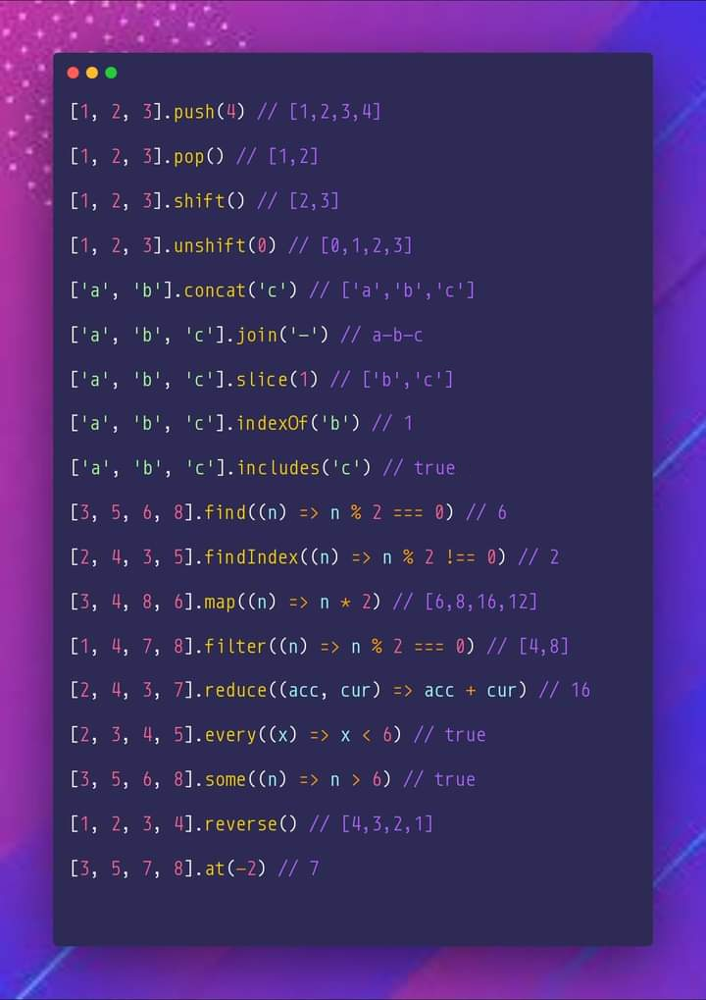

# JS Array Methods Cheatsheet

## Notes

Comments show the resulting array, not the return value, for the mutating methods:

- `push` — mutates, returns new length
- `pop` — mutates, returns removed element
- `shift` — mutates, returns removed element
- `unshift` — mutates, returns new length
- `reverse` — mutates, returns the same array
