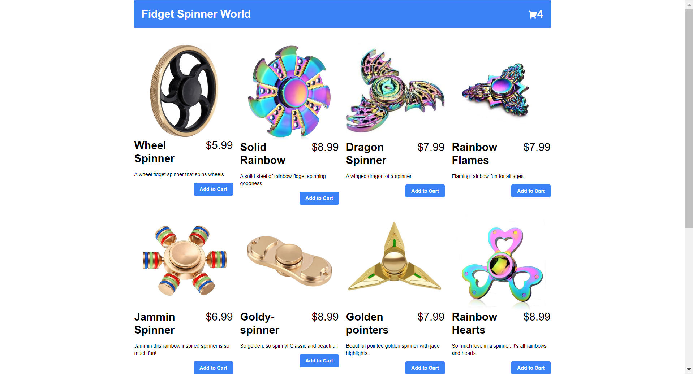
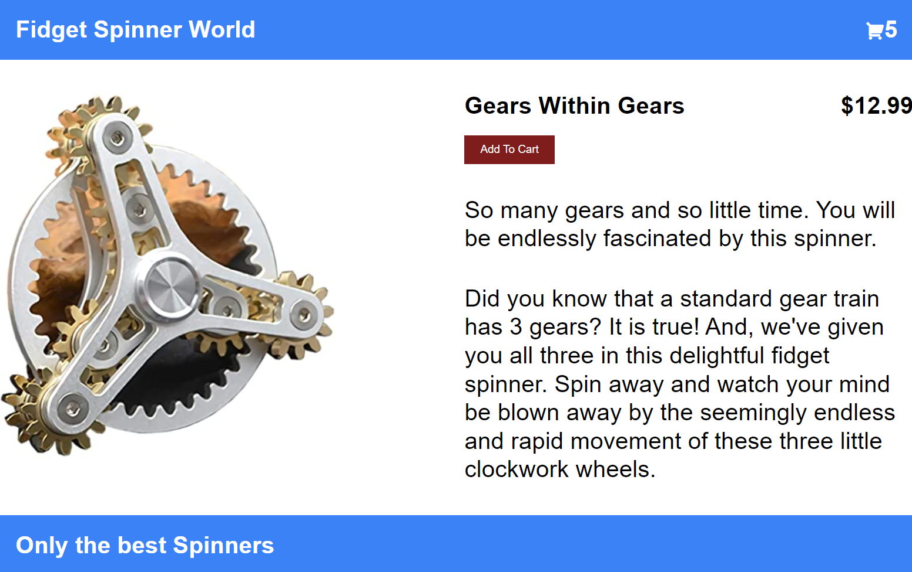
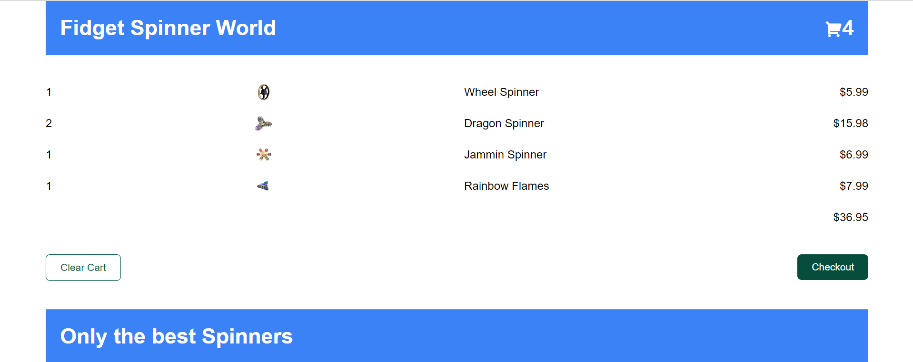

## Second micro frontend app.

There are 5 projects:
- home
- pdp (page detail product)
- cart
- server (api)
- addtocart (small SolidJS project)

All of them are frontend, but 'server' which is `Nest JS` backend.

Regarding the frontend projects, all of them use `React`, except addtoCart which uses `SolidJS`.

## Getting Started

To run the project you have to create a terminal for each one of those projects and execute the following commands:
```bash
npm install
```
```bash
npm start
```

## Images
- Home:


- Page Detail Product:


- Cart:


---

#### Made via-> https://www.youtube.com/watch?v=lKKsjpH09dU&list=WL&index=1