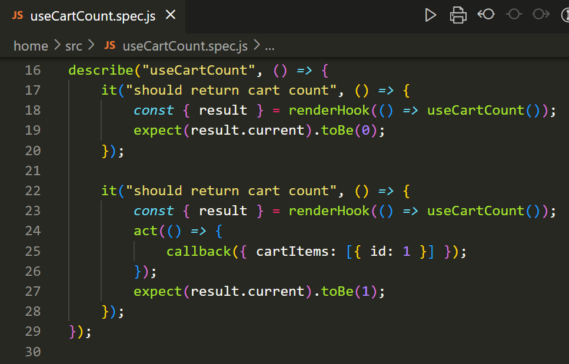
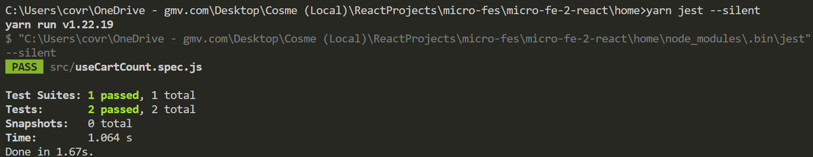
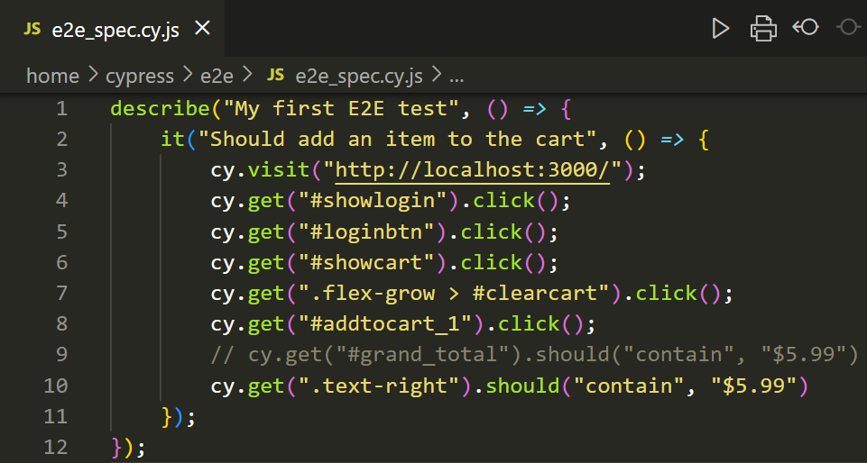

# Fidget Spinners E-Commerce.

There are 5 projects:
- home
- pdp (page detail product)
- cart
- server (api)
- addtocart (small SolidJS project)

All of them are micro-frontends; but 'server', which uses `Nest JS`, is backend.

Regarding the micro-frontends projects, all of them use `React`, except addtoCart which uses `SolidJS`.

## Getting Started

To run this you have to create a terminal for each one of those projects and execute the following commands:
```bash
npm install
```
```bash
npm start
```

## Images
- Home:


- Page Detail Product:


- Cart:


# 🧪 TESTS
We have done tests with Jest (Unit Testing) and with Cypress (E2E), here's how:
## 1️⃣ JEST (Unit testings)
1. Install JEST:
```bash
yarn add --dev jest
```
or 
```bash
npm install --save-dev jest
```
2. Create a new file `jest.config.js`. An example of this config file:
```js
module.exports = {
    testEnvironment: "jsdom",
};
```

3. Execute it:
```bash
yarn jest
```
or 
```bash
npm jest
```
Example code:
- 

Example result:
- 

## 2️⃣ Cypress (E2E tests)
1. Install Cypress:
```bash
yarn add --dev cypress
```
or 
```bash
npm install --save-dev cypress
```
2. A new cypress folder should appear. Inside there in integration or in e2e you will create new E2E testing files.

3. Execute it:
```bash
npx cypress open
```

Example code:
- 

Example result:
- 

---

#### Made via-> https://www.youtube.com/watch?v=lKKsjpH09dU&list=WL&index=1