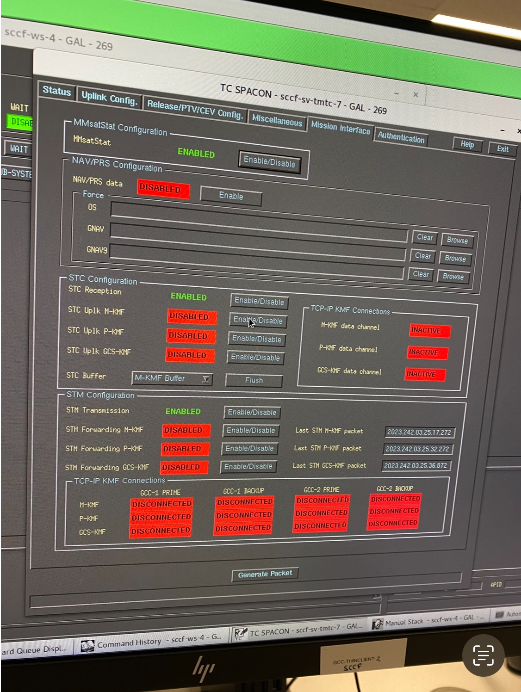

### MIF Image:


### Steps:
1. Install Prime React:

```bash
npm install primereact
```

2. So that everything works we will need a theme from prime https://primereact.org/theming/, you can take this as an example: 

```tsx
import React from 'react';
import ReactDOM from 'react-dom';
import { PrimeReactProvider } from 'primereact/api';
import 'primereact/resources/themes/lara-light-indigo/theme.css';   // theme
import 'primeicons/primeicons.css';
import 'primereact/resources/primereact.css';
```

3. Install primeicons:
```bash
npm install primeicons --save
```

4. Install an utility classes library for our css. We can choose Prime Flex, tailwind, bootstrap or any other. For Prime Flex: 
```bash
npm install primeflex --save
```
Then we have to add it in our index.css or index.scss: 
```scss
@import 'primeflex/primeflex.css'; 
```

---

To import everything:
```bash
npm i primereact primeicons primeflex sass sass-loader
```