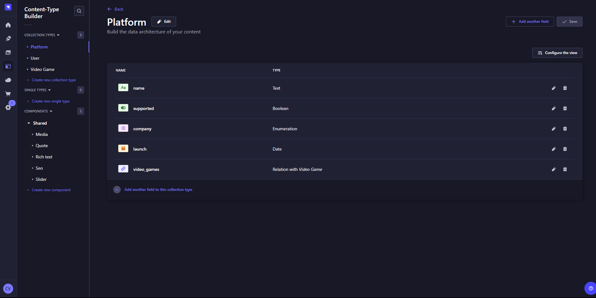

# Next JS advanced and Strapi

## Strapi
Strapi is a CMS ("Content Management System", e.g. WordPress). Actually it is a headless CMS which means that its not attached to a frontend, so you can use it with any frontend you want.

Create project:
```sh
npx create-strapi-app@latest my-project
```

Run it:
```sh
npm run develop
```

Then you have create an admin user in the ui.

After that this is an image of the CMS panel:


In `Content Type-Builder` you can create classes.

In `Content Manager` you can insert values of those classes.

In `Market Place` you can select extensions like GraphQL.