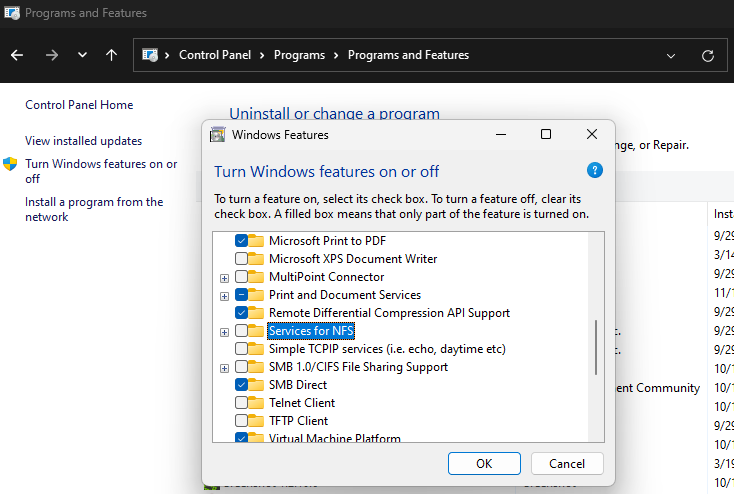

# SNMP

### Check if you have SNMP installed

If in the menu you don't have an option like "SNMP" then you don't have it.

Then you will have to install it, to install it follow this
```
Open Powershell with Administrator credentials

issue the following commands:

Get-WindowsCapability -Online -Name "SNMP*"

Will show Not Present

Add-WindowsCapability -Online -Name "SNMP.Client~~~~0.0.1.0"

Get-WindowsCapability -Online -Name "SNMP*"

Should now show Installed
```