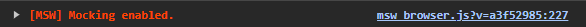

# MSW with React

## 🧠 Why?
Mock Service Worker (MSW) is an API mocking library for browser and Node.js. With MSW, you can intercept outgoing requests, observe them, and respond to them using mocked responses.

## 1. How to install?
```bash
npm install msw --save-dev
```

## 2. Initialize MSW
```bash
npx msw init ./public --save
```

### What now?
- You should have mockServiceWorker.js inside your `public` folder
- If you want to use it with `React` you should create 2 files like `browser.js` and `handlers.js` inside `src/mocks` folder, like in this project.
- You should change `main.jsx` to be like this: 
```jsx
import React from 'react'
import ReactDOM from 'react-dom/client'
import App from './App.jsx'
import './index.css'

async function deferRender() {
  // if (process.env.NODE_ENV !== 'development') {
  //   return
  // }
  const { worker } = await import('./mocks/browser.js');
  return worker.start();
}

deferRender().then(() => {
  ReactDOM.createRoot(document.getElementById('root')).render(
    <React.StrictMode>
      <App />
    </React.StrictMode>,
  )
})
```
It is important to add the return early if the environment mode is development!!
- By now you should be able to see this in your browser inspector:

It's a good sign. It means that It seems that it's working until now.
- Finally you can edit `App.jsx` to something like this: 
```jsx
import { useEffect, useState } from "react";

function App() {
  const [users, setUsers] = useState([]);

  useEffect(() => {
    // fetch("http://localhost:5173/api/users")
    fetch("/api/users")
      .then((res) => res.json())
      .then((data) => {
        console.log(data)
        setUsers(data)
      })
  }, [])
  return <div> 
    {users.map((user) => (
      <div key={user.id}>{user.name}</div>
    ))}
  </div>;
}

export default App
```
And this should be printing the names of the users that you have in your `handlers.js` file

Happy coding! 🥰✍️

---
###### I'm following this tutorial-> https://www.youtube.com/watch?v=pP8FQnv6o7A&ab_channel=AnsontheDeveloper

