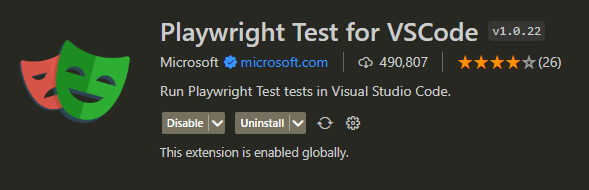
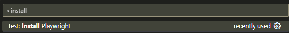
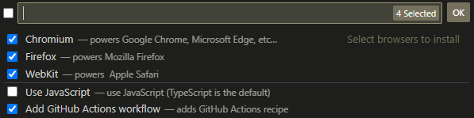
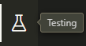
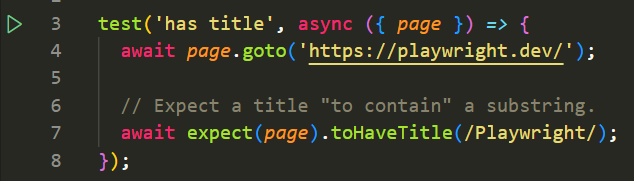
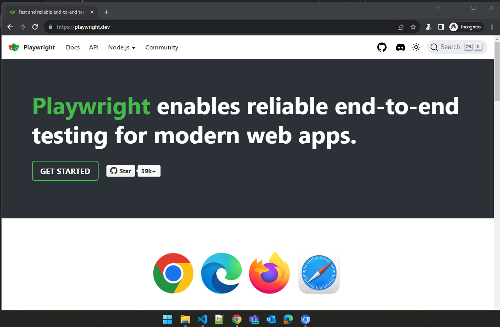
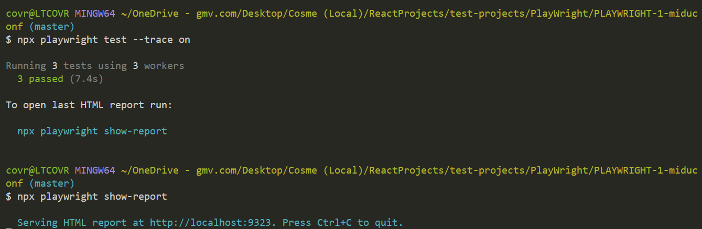
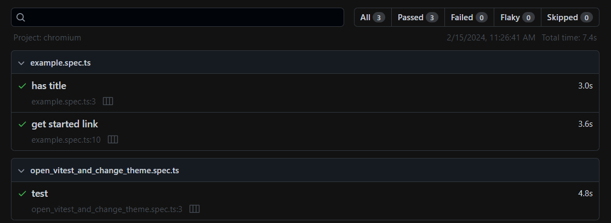
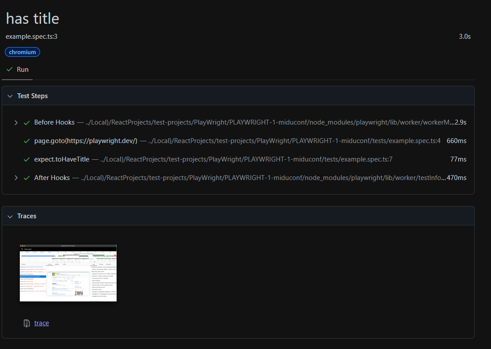
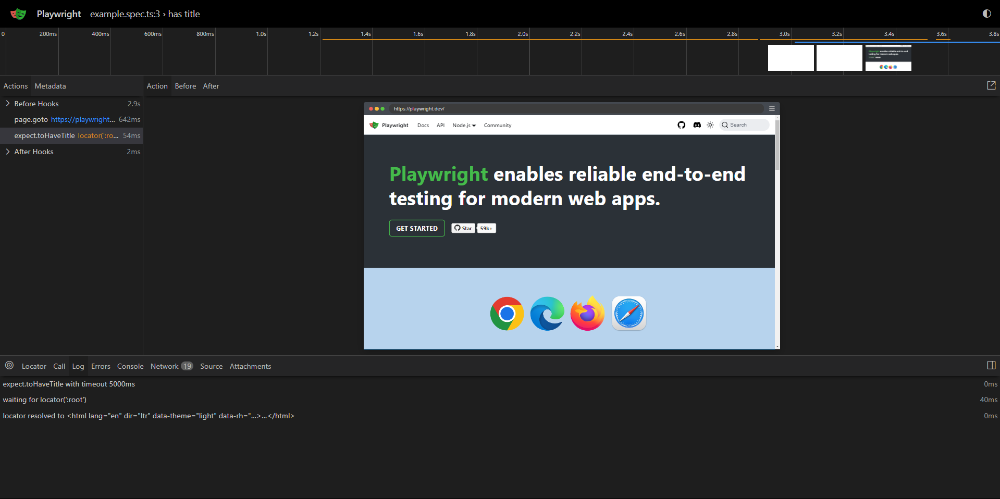

# Playwright

## 🧠 Why?
Playwright is an E2E testing framework. It offers robust cross-browser support, reliable automation capabilities, and an extensive feature set for testing modern web applications effectively.

## 🚀 Getting Started

- Install this vs code extension:



- Create new Playwright project using:
```
Ctrl + Shift + P -> and type 'Install Playwright'
```



- Pick the browsers that you want, if you want js (ts is default), and if you want to add github actions (this is for CI/CD).



A new repository will be created.

## 🔍 Brief repository explanation
The following files deserve a special mention:
- `playwright.config.ts`: Playwright configuration
- `.github\workflows\playwright.yml`: GitHub actions deployment
- `tests\example.spec.ts`: Here you have an example of a Playwright test

## 🤔 How to use
- Open `tests\example.spec.ts`
- Open the PlayWright testing option in the lateral menu in VS Code:



- Enable `Show browser` at the bottom of the lateral menu


- Click on the green arrow at the left of the test to run it:



- Once you run the test, if for instance you picked chromium, a chromium window will open:



## ✍️ Additional features (traces and report)
- We can see step by step what happened in our test with the traces, to achieve it use these commands:

```bash
npx playwright test --trace on
```
```bash
npx playwright show-report
```
Output:


- A report with the results of the tests will be opened:



- Click in one of them:



- And if you click in the trace another window will be opened:



In this window you have the actions in the left, and the timeline at the top. This way you will be able to follow step by step what happened in each moment.

For more information here is the official Playwright [documentation.](https://playwright.dev/docs/api/class-test)

Feel free to experiment 😀!